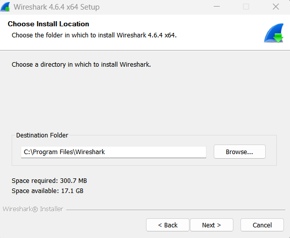
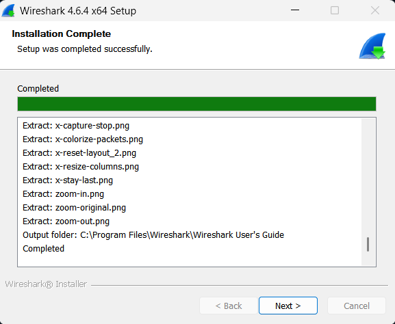

# Laporan Praktikum Minggu 1

Nama       : Gde Andika Ananta Putra  
NIM        : 103072400014  
Kelas      : IF-04-05  
Mata Kuliah: Jaringan Komputer  
__________________________________________

## Instalasi Wireshark (Modul 1)

### Cara singkat pasang Wireshark:
1. Buka https://www.wireshark.org/download.html
2. Pilih installer yang cocok untuk OS masing-masing, lalu download (pakai versi terbaru)
3. Jalankan file installer yang sudah di-download
4. Ikuti step instalasi sampai selesai (pilih lokasi instalasi kalau diminta)

### Lampiran instalasi
- Download page  

- Installation Part 1  

- Installation Part 2  

- Installation Part 3  

- Installation Part 4  

- Installation Part 5  

- Installation Part 6  

- Installation Part 7  

- Installation Part 8  

- Installation Part 9  

- Installation Part 10  

- Installation Done  

## Tugas Praktikum Minggu 1 (Modul 2)

### Cara cek HTTP request/response (basic):
1. Buka Wireshark
2. Pilih interface yang mau dipakai untuk capture (mis. Wi‑Fi). Kalau pakai VPN, matikan dulu
3. Buka link ini di browser: http://gaia.cs.umass.edu/wireshark-labs/INTRO-wireshark-file1.html (pakai HTTP)
4. Halaman akan menampilkan teks singkat: "Congratulations! You've downloaded the first Wireshark lab file!"
5. Di Wireshark, ketik `http` di kolom filter
6. Cari paket yang bertipe `(text/html)`
7. Buka bagian "Line-based text data" untuk lihat isi HTML:

Kalau mau berhenti merekam, klik tombol stop capture lalu tutup file capture.

### Lampiran hasil
 - Tampilan Wireshark
 
 - Capture dari Wi‑Fi
 
 - Tampilan browser pada halaman contoh
 
 - Capture Wi‑Fi dengan filter HTTP
 
 - Line-based text data (response `text/html`)
 
