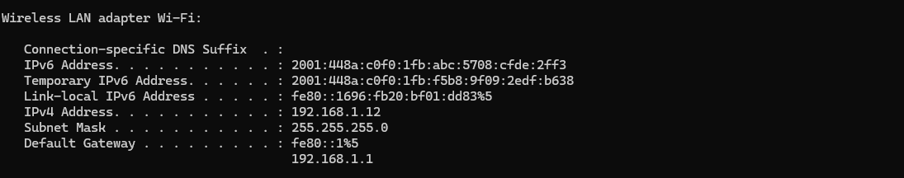
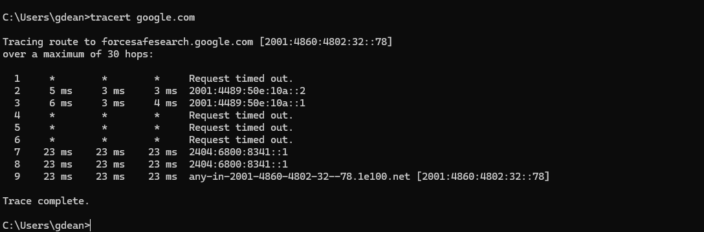
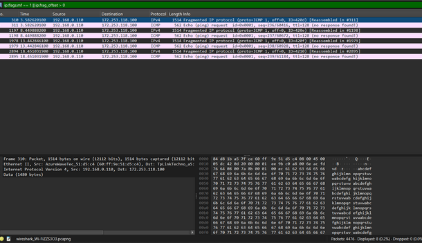
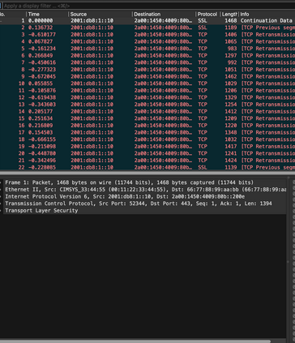
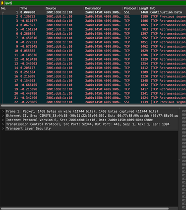

Nama       : Gde Andika Ananta Putra  
NIM        : 103072400014  
Kelas      : IF-04-05  
Mata Kuliah: Jaringan Komputer
__________________________________________

# MODUL 10 IP

## 1 IP address
IP Address (Internet Protocol Address) adalah alamat unik yang digunakan untuk mengenali perangkat dalam jaringan. IP address berfungsi untuk membantu data dikirim ke perangkat tujuan dengan benar.

**Jenis-jenis**
- IPv4 : menggunakan 32-bit contoh:  192.168.184.1
- IPv6 : menggunakan 128-bit contoh: 2001:db8::1

Seperti ini

- Link-local IPv6 Address . . . . . : fe80::da35:2b4:714c:d372%3
- IPv4 Address. . . . . . . . . . . : 192.168.100.132

## 2. Traceroute dari suatu website
Traceroute adalah metode yang digunakan untuk mengetahui jalur atau hop yang dilewati paket data dari komputer menuju server tujuan.

**Fungsi Traceroute**
- Menampilkan jalur (hop) yang dilewati data.
- Mengetahui waktu tempuh pada setiap hop.
- Membantu mendeteksi masalah jaringan.

**Cara Melihat Traceroute dari Website**
1. Buka CMD
2. Ketik tracert google.com

- Paket melewati 25 hop sebelum mencapai server Google. Hop awal merupakan router lokal dan jaringan internal ISP, sedangkan hop berikutnya masuk ke jaringan publik hingga jaringan Google. Beberapa hop menampilkan RTO karena router tidak merespons paket traceroute, umumnya akibat pemblokiran ICMP. Paket akhirnya berhasil mencapai server Google pada hop ke-25 dengan waktu tempuh sekitar 1–40 ms, yang menunjukkan kondisi jaringan cukup baik dan responsif.

## 3. ICMP, MTU, TTL
### ICMP (Internet Control Message Protocol)
ICMP adalah protokol yang digunakan untuk memberikan informasi mengenai kondisi jaringan, seperti error reporting dan pengecekan koneksi.
Contoh penggunaan ICMP:
- Ping
- Traceroute
- Pesan error jaringan
### MTU (Maximum Transmission Unit)
MTU (Maximum Transmission Unit) adalah ukuran maksimum data yang dapat dikirim dalam satu frame jaringan tanpa fragmentasi. Pada jaringan Ethernet, nilai MTU umumnya 1500 byte. Jika ukuran paket melebihi MTU, paket akan dipecah menjadi beberapa fragmen agar dapat dikirim melalui jaringan.

### TTL (Time To Live)

TTL (Time To Live) adalah batas jumlah hop atau router yang dapat dilalui paket data di jaringan. Setiap melewati router, nilai TTL berkurang satu. Jika nilainya mencapai 0, paket akan dibuang dan router mengirim pesan ICMP Time Exceeded. Mekanisme ini berfungsi untuk mencegah paket beredar terus-menerus akibat kesalahan routing.

## 4. Cari contoh Fragmentasi di wireshark yang kalian lakukan
Fragmentasi adalah proses pemecahan paket IP menjadi beberapa bagian yang lebih kecil karena ukuran paket melebihi nilai MTU jaringan.
Hasil Fragmentasi:
1. Buka Wireshark dan pilih jaringan yang aktif (WiFi/en0)
2. Buka terminal masukkan ini "ping google.com -l 2000"
4. Kembali ke wireshark stop capture, lalu filter "ip.flags.mf == 1 || ip.frag_offset >0"

## 5. Carilah IPv6 di wireshark yang kalian lakukan
IPv6 adalah versi terbaru dari Internet Protocol yang digunakan untuk komunikasi data di jaringan internet. IPv6 memiliki alamat 128-bit sehingga dapat menyediakan alamat IP lebih banyak dibandingkan IPv4.
### Analisis IPv6 di Wireshark

1. Buka file ipv6_sample.pcap dengan wireshark

2. Filter "ipv6"

Berdasarkan hasil capture Wireshark, terdeteksi paket yang menggunakan protokol IPv6, ditunjukkan oleh alamat sumber dan tujuan yang berformat heksadesimal dipisahkan tanda titik dua (:). Paket tersebut menggunakan TCP pada port 443, yang mengindikasikan komunikasi HTTPS. Selain itu, ditemukan beberapa TCP Retransmission, yang menunjukkan adanya pengiriman ulang paket selama proses komunikasi.