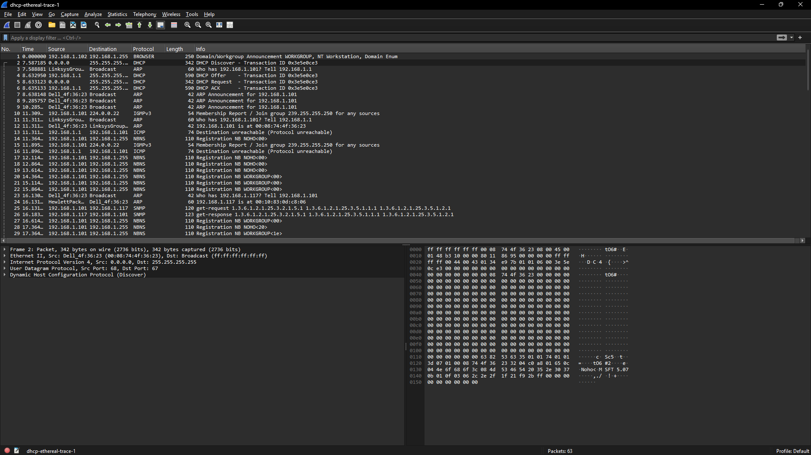
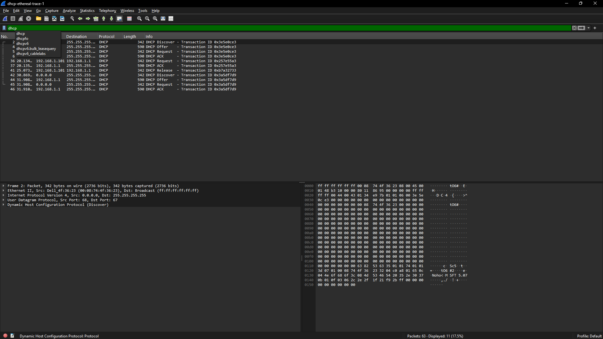

Nama       : Gde Andika Ananta Putra  
NIM        : 103072400014  
Kelas      : IF-04-05  
Mata Kuliah: Jaringan Komputer
__________________________________________

# DHCP
DHCP (Dynamic Host Configuration Protocol) adalah protokol yang secara otomatis memberikan konfigurasi jaringan kepada perangkat yang terhubung, seperti IP address, subnet mask, gateway, dan DNS server. Dengan DHCP, pengguna tidak perlu melakukan pengaturan jaringan secara manual sehingga proses koneksi menjadi lebih mudah dan efisien.

**Kelebihan DHCP:**
1. Memberikan alamat IP secara otomatis dan cepat.
2. Mempermudah pengelolaan konfigurasi jaringan.
3. Mengurangi risiko terjadinya konflik alamat IP.
4. Meminimalkan kesalahan konfigurasi manual.
5. Efektif digunakan pada jaringan dengan banyak perangkat.

**Kekurangan DHCP:**

1. Alamat IP perangkat dapat berubah secara dinamis.
2. Membutuhkan server DHCP yang dikonfigurasi dan dikelola dengan baik.
3. Jika server DHCP mengalami gangguan, klien tidak dapat memperoleh alamat IP secara otomatis.
4. Berpotensi menimbulkan masalah keamanan jika tidak dikelola dengan benar.

##  Cara Kerja Proses DORA
DORA adalah proses komunikasi antara klien dan server DHCP untuk memperoleh alamat IP secara otomatis. Proses ini terdiri dari empat tahap, yaitu Discover (mencari server DHCP), Offer (penawaran konfigurasi IP), Request (permintaan IP oleh klien), dan Acknowledgement/ACK (konfirmasi pemberian IP oleh server).

**Langkah-langkah**
1. Download dan setelah itu ekstrak file http://gaia.cs.umass.edu/wireshark-labs/wireshark-traces.zip
2. Buka file DHCP menggunakan Wireshark

3. Gunakan filter dhcp untuk menampilkan paket DHCP saja

##  Tahapan DORA

1. **Discover**
Klien mengirim pesan DHCP Discover untuk mencari server DHCP yang tersedia. Karena belum memiliki alamat IP, paket dikirim secara broadcast menggunakan alamat 0.0.0.0.

2. **Offer**
Server DHCP merespons dengan DHCP Offer yang berisi penawaran alamat IP beserta konfigurasi jaringan lainnya.

3. **Request**
Klien memilih penawaran yang diterima dan mengirim DHCP Request sebagai permintaan penggunaan alamat IP tersebut.

4. **Acknowledgement (ACK)**
Server mengirim DHCP ACK untuk mengonfirmasi pemberian alamat IP. Setelah itu, klien dapat menggunakan jaringan dengan konfigurasi yang diberikan.