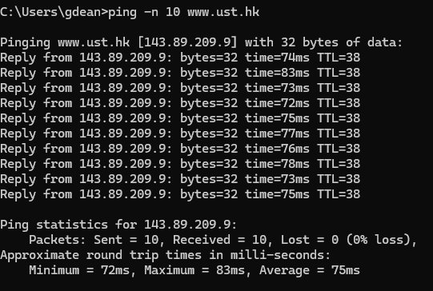
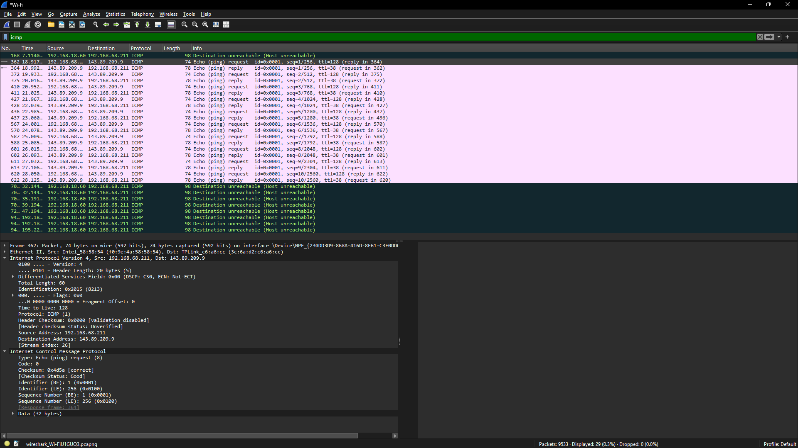
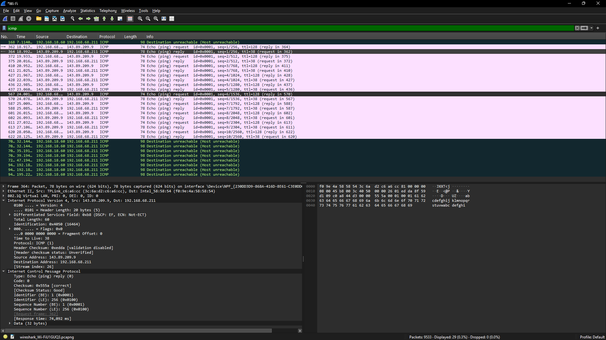
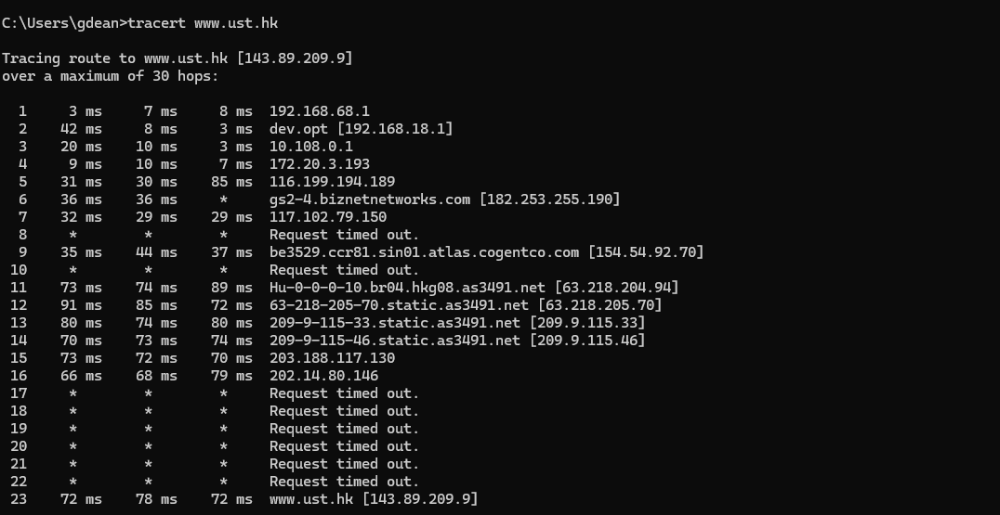
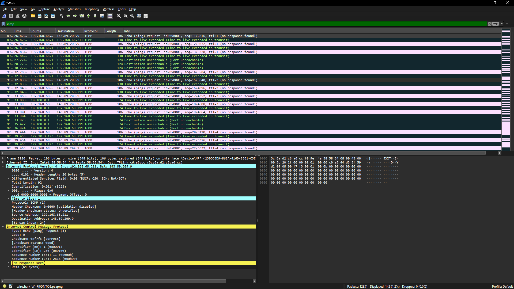
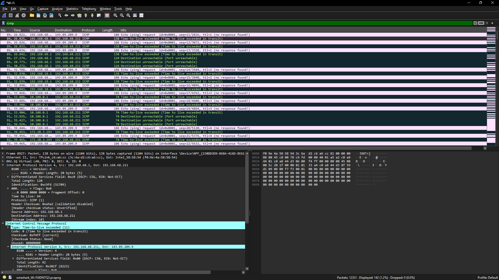

Nama       : Gde Andika Ananta Putra  
NIM        : 103072400014  
Kelas      : IF-04-05  
Mata Kuliah: Jaringan Komputer
__________________________________________

# ICMP
ICMP (Internet Control Message Protocol) digunakan untuk mendukung komunikasi dan pemantauan jaringan. Fungsi utamanya meliputi:

1. Mendiagnosis kondisi jaringan dan konektivitas.
2. Memastikan host tujuan dapat dijangkau.
3. Memberikan laporan kesalahan saat terjadi masalah pengiriman paket.
4. Membantu proses troubleshooting dan analisis gangguan jaringan.

## ICMP Digunakan Untuk
1. Memeriksa apakah host atau perangkat tujuan aktif dan dapat dijangkau menggunakan perintah ping.
2. Menelusuri jalur paket data melalui traceroute/tracert untuk mengetahui router (hop) yang dilewati.
3. Memberikan informasi kesalahan, seperti Destination Unreachable ketika tujuan tidak dapat dicapai.
4. Mengirim pesan Time Exceeded saat nilai TTL habis karena paket telah melewati batas hop yang diizinkan.

## Hubungan IP dengan ICMP
ICMP bekerja bersama protokol IP. Saat paket IP dikirim melalui jaringan, ICMP digunakan untuk membawa pesan kontrol dan informasi kesalahan yang berkaitan dengan proses pengiriman tersebut. Dengan kata lain, ICMP tidak digunakan untuk mengirim data pengguna, melainkan untuk membantu IP dalam memantau dan mengelola komunikasi jaringan.

## Isi Paket ICMP
Komponen utama pada paket ICMP meliputi:

1. Type – Menunjukkan jenis pesan ICMP, seperti Echo Request, Echo Reply, atau Destination Unreachable.
2. Code – Memberikan informasi lebih spesifik mengenai jenis pesan ICMP.
3. Checksum – Digunakan untuk memeriksa integritas data dan mendeteksi kesalahan pada paket.
4. Identifier – Berfungsi sebagai penanda untuk membedakan paket ICMP.
5. Sequence Number – Menunjukkan nomor urut paket agar dapat dicocokkan dengan respons yang diterima.
6. Data/Payload – Berisi data tambahan yang dikirim bersama pesan ICMP.

Komponen-komponen tersebut memungkinkan ICMP membantu pemantauan konektivitas, pelaporan kesalahan, dan analisis kinerja jaringan.

## Analisis ICMP yang Dihasilkan Oleh Ping
1. Pertama kitabuka wireshark dan pilih jaringan Wifi
2. Buka CMD, kemudian ketikan perintah ping -n 10 www.ust.hk

3. Stop capture pada wireshark
4. Isi filter ICMP
5. Pilih dan expand satu paket ICMP Echo Request
6. Pilih dan expand satu paket ICMP Echo Reply

## hasil di wireshark

- ICMP Echo Request

1. Type = 8
Menunjukkan bahwa paket ICMP merupakan Echo Request, yaitu permintaan ping yang dikirim ke host tujuan.

2. Code = 0
Menandakan tidak ada informasi atau detail kesalahan tambahan pada pesan ICMP tersebut.

3. Checksum = 0x4d5a [correct]
Menunjukkan bahwa paket memiliki nilai checksum yang valid sehingga tidak terjadi kerusakan data selama transmisi.

4. Identifier = 1 (0x0001)
Digunakan sebagai penanda untuk mencocokkan paket Echo Request dengan Echo Reply yang diterima.

5. Sequence Number = 1 (0x0001)
Menunjukkan bahwa paket tersebut merupakan urutan ping pertama yang dikirim.

6. Informasi Paket
Paket berasal dari 192.168.68.155 menuju 143.89.209.9 dengan ukuran 74 byte, yang menunjukkan proses pengujian konektivitas jaringan menggunakan perintah ping.

- ICMP Echo Reply

1. Type = 0
Menunjukkan bahwa paket ICMP merupakan Echo Reply, yaitu balasan dari permintaan ping yang telah dikirim sebelumnya.
2. Code = 0
Menandakan tidak terdapat informasi tambahan atau kesalahan pada paket balasan.
3. Checksum = 0x555a [correct]
Menunjukkan bahwa paket diterima dengan integritas data yang baik tanpa kerusakan selama transmisi.
4. Identifier = 1 (0x0001)
Memiliki nilai yang sama dengan paket Echo Request untuk memastikan balasan sesuai dengan permintaan yang dikirim.
5. Sequence Number = 1 (0x0001)
Menunjukkan bahwa paket ini merupakan balasan untuk paket ping urutan pertama.
6. Response Time = 74,827 ms
Menunjukkan waktu yang dibutuhkan sejak Echo Request dikirim hingga Echo Reply diterima.
7. Informasi Paket
Paket berasal dari 143.89.209.9 menuju 192.168.68.155 dengan ukuran 78 byte, yang menandakan host tujuan berhasil merespons permintaan ping dan konektivitas jaringan berjalan dengan baik.

## Analisis ICMP yang Dihasilkan Oleh Traceroute
1. Kita buka wireshark lagi lalu pilih wifi
2. Buka CMD, kemudian ketikan perintah tracert www.ust.hk

3. Capture pada wireshark
4. Lakukan filter ICMP
5. Pilih dan expand satu paket ICMP Echo Request
6. Pilih dan expand satu paket Time To Live

## hasil di wireshark

- Format dan Isi Pesan ICMP
1. ICMP Echo Request

- Type = 8 → menunjukkan paket merupakan Echo Request atau permintaan ping
- Code = 0 → tidak terdapat informasi tambahan/error pada paket
- Checksum = 0xf7ae [correct] → checksum valid sehingga paket tidak mengalami kerusakan saat transmisi
- Identifier = 1 (0x0001) → digunakan sebagai penanda paket request
- Sequence Number = 80 (0x0050) → menunjukkan bahwa paket ini merupakan paket urutan ke-80

2. ICMP Time Exceeded

- Type = 11 → menunjukkan paket merupakan Time Exceeded
- Code = 0 → berarti TTL exceeded in transit, yaitu TTL habis di perjalanan
- Checksum = 0xf4ff [correct] → menandakan paket diterima tanpa error
- Source IP = 192.168.68.1 → router yang mengirim pesan TTL exceeded
- Destination IP = 192.168.68.155 → host pengirim traceroute
- Time to Live = 1 → nilai TTL pada paket asli yang dikirim, menunjukkan traceroute sedang menelusuri hop pertama