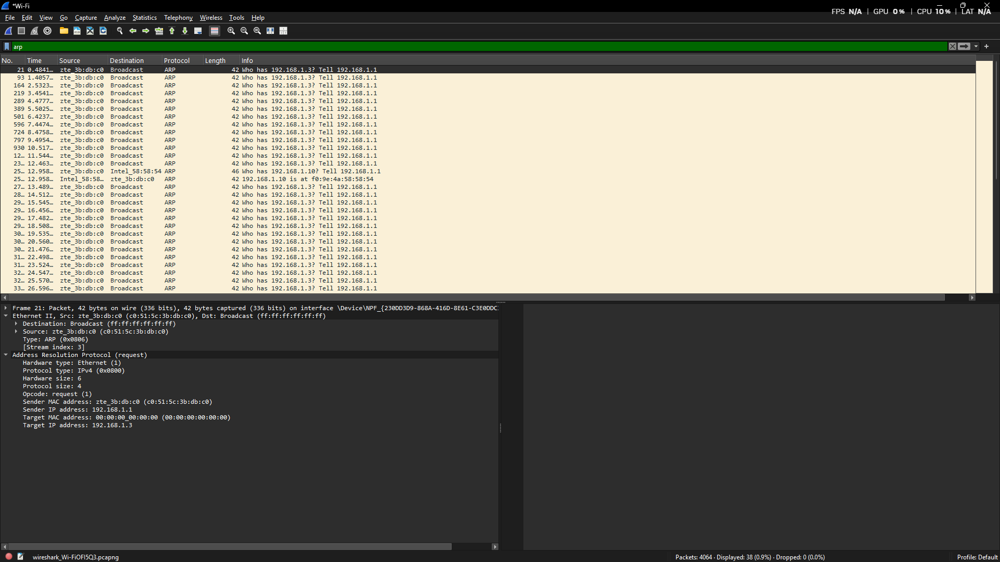

Nama       : Gde Andika Ananta Putra  
NIM        : 103072400014  
Kelas      : IF-04-05  
Mata Kuliah: Jaringan Komputer
__________________________________________

# MODUL 13 ETHERNET DAN ARP

## Ethernet
Ethernet merupakan teknologi jaringan yang digunakan untuk menghubungkan perangkat dalam jaringan lokal (LAN). Ethernet bekerja pada Data Link Layer dan menggunakan MAC Address sebagai identitas unik setiap perangkat. Saat data dikirim melalui jaringan, Ethernet akan membungkus data tersebut ke dalam frame agar dapat diteruskan ke tujuan yang benar.

## Konsep Ethernet
Ethernet berfungsi sebagai media komunikasi antar perangkat dalam jaringan lokal. Setiap frame Ethernet memiliki informasi seperti Source MAC Address, Destination MAC Address, dan Type Field yang menunjukkan jenis protokol yang dibawa.

## ARP
ARP (Address Resolution Protocol) adalah protokol yang digunakan untuk menerjemahkan alamat IP menjadi alamat MAC Address pada jaringan lokal. ARP diperlukan karena proses komunikasi pada Ethernet menggunakan MAC Address, sedangkan pengguna biasanya mengenali perangkat berdasarkan alamat IP.

## Konsep ARP
ARP bekerja di antara Data Link Layer dan Network Layer. Saat sebuah perangkat ingin mengirim data ke IP tertentu, perangkat tersebut harus mengetahui MAC Address tujuan terlebih dahulu. Jika belum diketahui, ARP akan melakukan proses pencarian melalui ARP Request dan ARP Reply.

### Cara Kerja ARP
1. Perangkat ingin mengirim data ke alamat IP tertentu.
2. Sistem memeriksa ARP Cache.
3. Jika data tidak ditemukan, perangkat mengirim ARP Request secara broadcast.
4. Perangkat tujuan mengirim ARP Reply yang berisi MAC Address.
5. Informasi disimpan ke ARP Cache.
6. Data dapat dikirim ke perangkat tujuan.

## Langkah-Langkah
1. Buka Command Prompt (CMD) sebagai Administrator, lalu jalankan perintah arp -d * untuk menghapus seluruh isi ARP Cache. Setelah itu, komputer akan melakukan proses ARP kembali saat berkomunikasi dengan perangkat lain di jaringan.

2. Buka **Wireshark**, kemudian pilih menu **Analyze → Enabled Protocols → IPv4** untuk mengaktifkan atau memeriksa protokol IPv4 yang akan dianalisis.

3. Start capture Wireshark
4. Membuka browser dan ketik http://gaia.cs.umass.edu/wireshark-labs/HTTP-ethereal-lab-file3.html
5. Stop capture Wireshark
6. Ketik filter: arp

Berdasarkan hasil capture Wireshark pada gambar, paket yang dipilih merupakan ARP Request (Opcode = 1). Terlihat perangkat dengan IP address 192.168.1.1 dan MAC address c0:51:5c:3b:db:c0 mengirimkan permintaan ARP untuk mencari perangkat yang memiliki IP address 192.168.1.3. Karena alamat MAC tujuan belum diketahui, paket dikirim menggunakan alamat broadcast (ff:ff:ff:ff:ff:ff) sehingga dapat diterima oleh seluruh perangkat yang berada dalam satu jaringan lokal. Informasi pada kolom Info menunjukkan pesan "Who has 192.168.1.3? Tell 192.168.1.1", yang berarti perangkat 192.168.1.1 sedang menanyakan siapa pemilik IP 192.168.1.3 agar dapat mengetahui alamat MAC-nya. Dari hasil capture tersebut dapat disimpulkan bahwa ARP (Address Resolution Protocol) berfungsi untuk memetakan atau menerjemahkan alamat IP menjadi alamat MAC, sehingga komunikasi antar perangkat dalam jaringan lokal dapat berlangsung dengan benar melalui frame Ethernet yang dikirim ke tujuan yang tepat.

