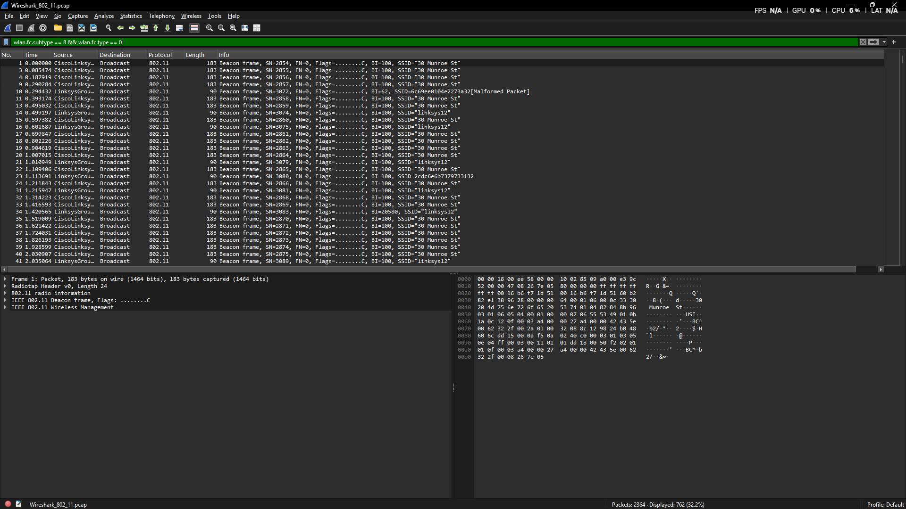
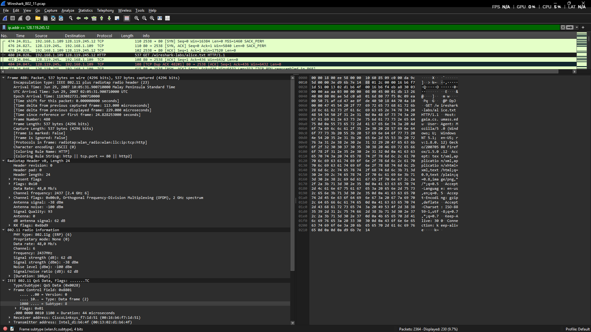
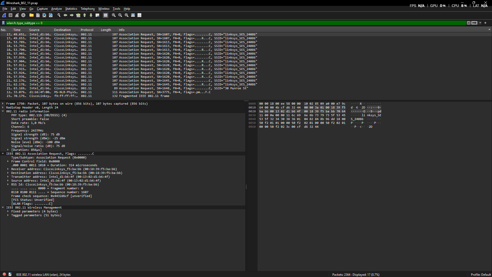
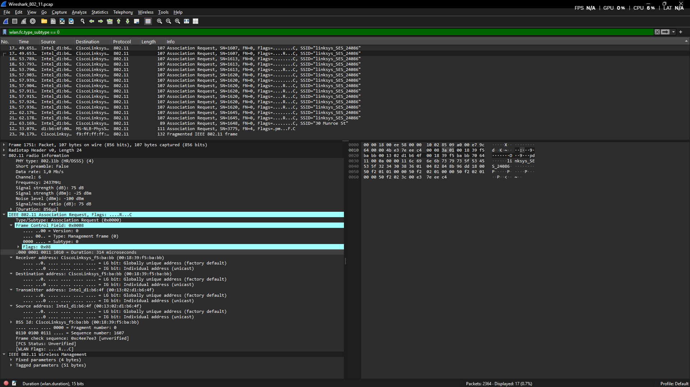
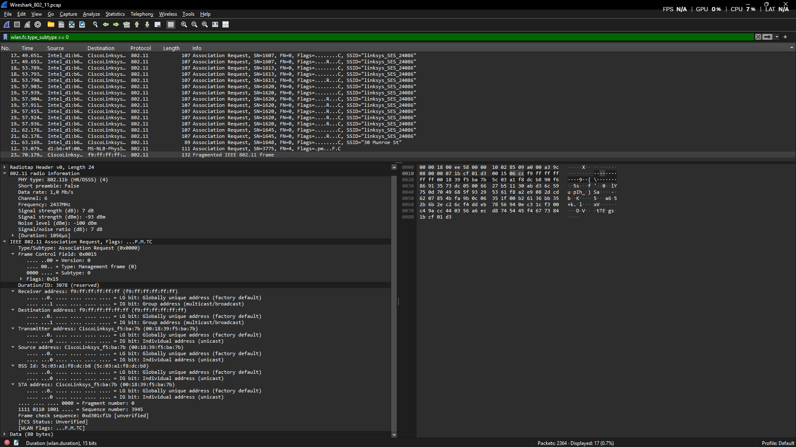
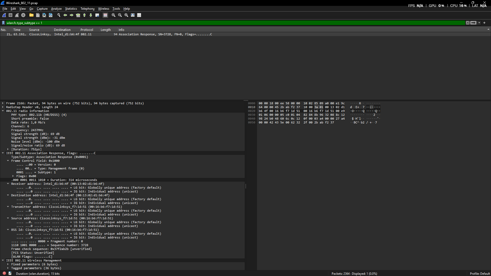

Nama       : Gde Andika Ananta Putra  
NIM        : 103072400014  
Kelas      : IF-04-05  
Mata Kuliah: Jaringan Komputer
__________________________________________

## WIFI
Jaringan Wi-Fi dan Standar IEEE 802.11

Materi minggu ini membahas jaringan Wi-Fi yang menggunakan standar IEEE 802.11, yaitu protokol yang mengatur komunikasi data pada jaringan nirkabel di lapisan fisik dan MAC.

Frekuensi 2,4 GHz dan 5 GHz

Frekuensi 2,4 GHz memiliki jangkauan lebih luas dan mampu menembus dinding dengan baik, tetapi lebih rentan terhadap interferensi. Sementara itu, 5 GHz menawarkan kecepatan yang lebih tinggi dan interferensi yang lebih rendah, namun jangkauannya lebih terbatas.

Access Point (AP)

Access Point (AP) berfungsi menghubungkan perangkat nirkabel ke jaringan lokal serta memperluas jangkauan sinyal Wi-Fi. Perangkat dapat berpindah ke AP terdekat secara otomatis tanpa perlu pengaturan ulang.

Beacon Frame

Beacon Frame adalah paket yang dikirim secara berkala oleh Access Point untuk menginformasikan keberadaan dan status jaringan Wi-Fi kepada perangkat di sekitarnya. Pada Wireshark, paket ini dapat difilter menggunakan:wlan.fc.subtype == 8 && wlan.fc.type == 0

## Langkah-Langkah
Disini KIta akan mengecek data Wireshark_802_11.pcap

Berdasarkan hasil tangkapan layar Wireshark, Beacon Frame dikirimkan secara periodik setiap sekitar 102 milidetik (Time delta from previous displayed frame: 102.350000 milliseconds). Tercatat bahwa aktivitas beaconing ini berlangsung dengan total pengiriman sebanyak 2364 paket, dengan 762 paket yang ditampilkan setelah filter diterapkan.

Berdasarkan hasil analisis Beacon Frame pada Wireshark, diperoleh beberapa informasi penting sebagai berikut:

- PHY Type (802.11b HR/DSSS) menunjukkan bahwa jaringan menggunakan standar fisik IEEE 802.11b dengan teknologi modulasi High-Rate Direct Sequence Spread Spectrum (HR/DSSS).
- Short Preamble (False) menandakan bahwa perangkat menggunakan Long Preamble, yang umumnya dipilih untuk menjaga kompatibilitas dengan perangkat yang lebih lama.
- Channel 6 / Frequency 2437 MHz menunjukkan bahwa Access Point beroperasi pada kanal 6 di pita frekuensi 2,4 GHz.
- Signal Strength dan Noise Level memperlihatkan kualitas sinyal yang sangat baik, dengan kekuatan sinyal sekitar -29 dBm dan tingkat noise -100 dBm, sehingga menghasilkan rasio sinyal terhadap noise (SNR) yang tinggi.
- Data Rate menunjukkan bahwa frame beacon dikirim dengan kecepatan 1,0 Mb/s, yang merupakan kecepatan dasar untuk pengiriman frame manajemen pada jaringan 802.11b.

Cek Tagged Parameters
- SSID Parameter Set menampilkan nama jaringan Wi-Fi (SSID) yaitu "30 Munroe St".
- Supported Rates menunjukkan kecepatan data yang didukung oleh Access Point, yaitu 1 Mbps, 2 Mbps, 5,5 Mbps, dan 11 Mbps.
- Extended Supported Rates berisi daftar kecepatan tambahan yang tersedia, mulai dari 6 Mbps hingga 54 Mbps, yang menunjukkan dukungan terhadap standar Wi-Fi yang lebih baru dengan kecepatan transfer yang lebih tinggi.

## Cek Data Transfer
Disini Kita mengecek perpindahan data, diterapkan filter alamat IP server Untuk menganalisis perpindahan data, diterapkan filter alamat IP server ip.addr == 128.119.245.12

Analisis Paket HTTP

Berdasarkan hasil capture Wireshark, terlihat proses Three-Way Handshake TCP yang terdiri dari SYN, SYN-ACK, dan ACK pada Frame 474–478. Setelah koneksi TCP berhasil dibangun, klien mengirimkan paket HTTP GET pada Frame 480 untuk meminta file /wireshark-labs/alice.txt menggunakan protokol HTTP/1.1 dari server dengan alamat IP 128.119.245.12.

Detail Paket

Berdasarkan informasi pada paket yang dipilih, data dikirim melalui beberapa lapisan protokol, yaitu IEEE 802.11 (Wi-Fi), LLC, IPv4, TCP, dan HTTP. Paket berasal dari alamat IP 192.168.1.109 menuju 128.119.245.12.

Pada lapisan nirkabel, paket ditransmisikan menggunakan standar IEEE 802.11g (ERP) pada Channel 6 dengan frekuensi 2437 MHz (2,4 GHz). Kecepatan transmisi yang digunakan adalah 48,0 Mb/s. Selain itu, kualitas sinyal yang diterima tergolong baik dengan signal strength -38 dBm, noise level -100 dBm, dan signal-to-noise ratio (SNR) sebesar 62 dB, yang menunjukkan kondisi koneksi nirkabel yang stabil saat proses pengiriman permintaan HTTP berlangsung.

## Mengecek Association & Disassociation

tulis filter "wlan.fc.type_subtype == 0"

**expand paket awal**

**Analisis Association Request**

Berdasarkan hasil capture Wireshark, pada Frame 1751 perangkat Intel_d1:b6:4f (00:13:02:d1:b6:4f) mengirimkan Association Request ke Access Point CiscoLinksys_f5:ba:bb (00:18:39:f5:ba:bb) untuk terhubung ke jaringan Wi-Fi dengan SSID "linksys_SES_24086".

**Detail Frame**
- Type/Subtype: Association Request (0x0000)
- Frame Control Field: 0x0000
- Duration: 314 mikrodetik
- Sequence Number: 1607
- BSS Id: CiscoLinksys_f5:ba:bb (00:18:39:f5:ba:bb)
- WLAN Flags: ........C

Frame ini menunjukkan proses permintaan asosiasi dari klien ke Access Point sebagai tahap sebelum perangkat dapat menggunakan jaringan Wi-Fi.

**expand paket akhir**

**Analisis Association Request dan Response**

Pada Frame 2162, klien mengirim Association Request ke Access Point CiscoLinksys_f7:1d:51 dengan SSID "30 Munroe St". Paket ini menunjukkan proses perpindahan (roaming) dari jaringan sebelumnya ke Access Point yang baru.

**Detail Frame:**

- Type/Subtype: Association Request (0x0000)
- Frame Control Field: 0x0015
- Duration: 3078 mikrodetik
- Sequence Number: 3945
- WLAN Flags: ...P.M.TC

Jika dibandingkan dengan Frame 1751, terjadi perubahan SSID dari "linksys_SES_24086" menjadi "30 Munroe St", yang menandakan klien berpindah ke jaringan Wi-Fi lain.

Balasan dari Access Point dapat dilihat pada Frame 2166 (Association Response) yang menunjukkan respons AP terhadap permintaan asosiasi dari klien.

- Type/Subtype: Association Response (0x0001)
- Frame Control Field: 0x1000
- Duration: 314 mikrodetik
- Sequence Number: 3728
- Receiver address: Intel_d1:b6:4f (00:13:02:d1:b6:4f)
- Transmitter address: CiscoLinksys_f7:1d:51 (00:16:b6:f7:1d:51)
- BSS Id: CiscoLinksys_f7:1d:51 (00:16:b6:f7:1d:51)

Di sini, Transmitter Address diisi oleh MAC Address milik perangkat pengirim respon, yaitu CiscoLinksys_f7:1d:51, sebagai tanda bahwa Access Point menyetujui permintaan koneksi dari klien (Intel_d1:b6:4f).
