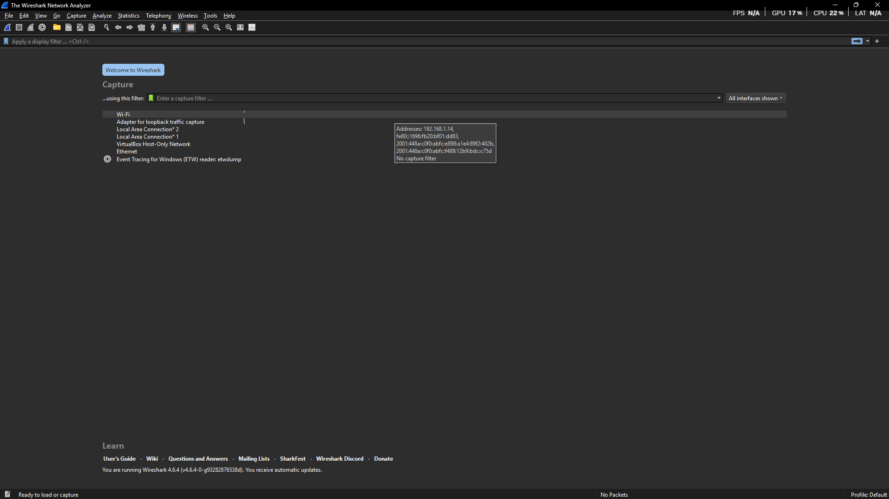
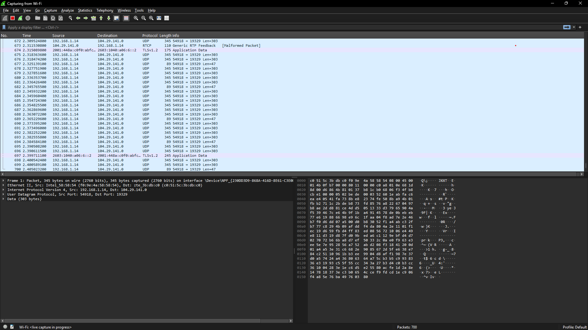
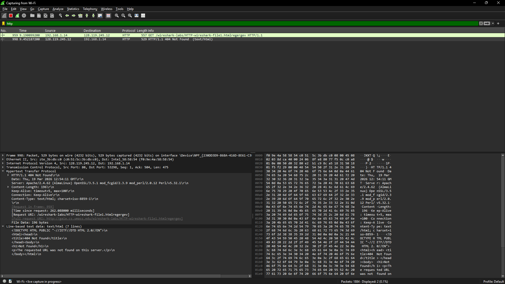
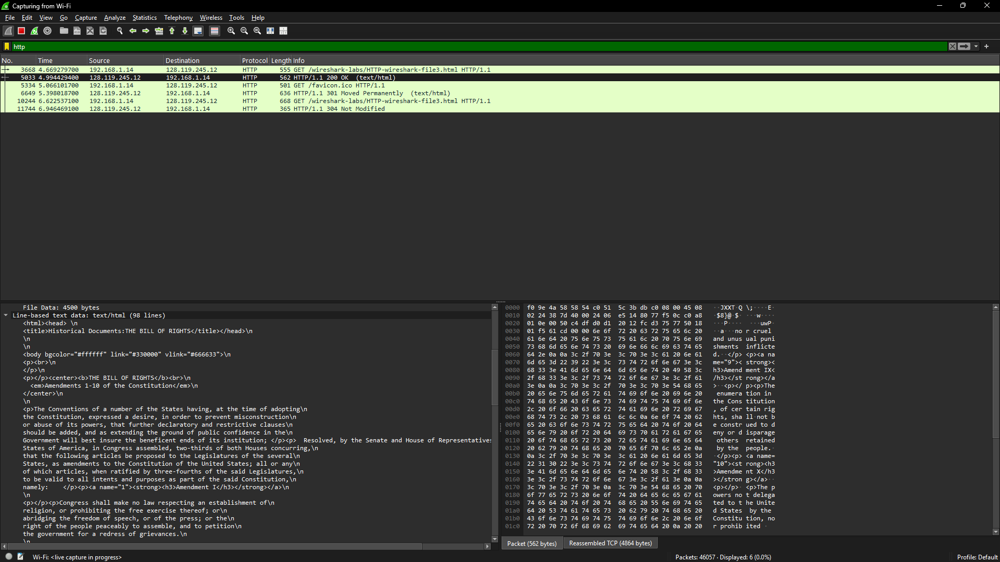
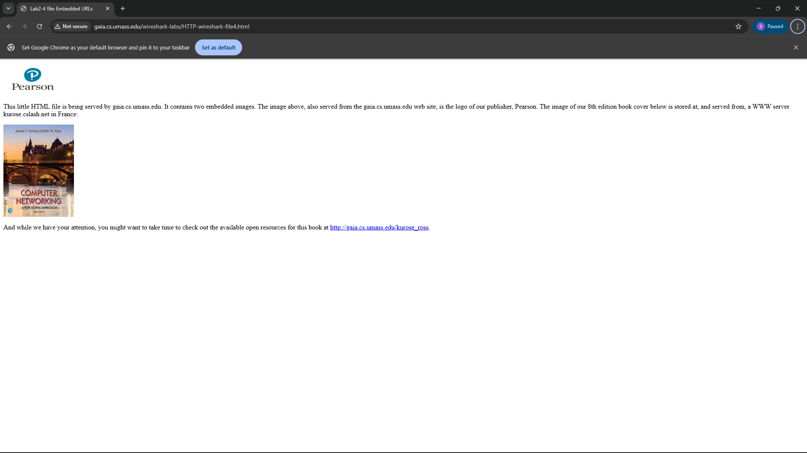
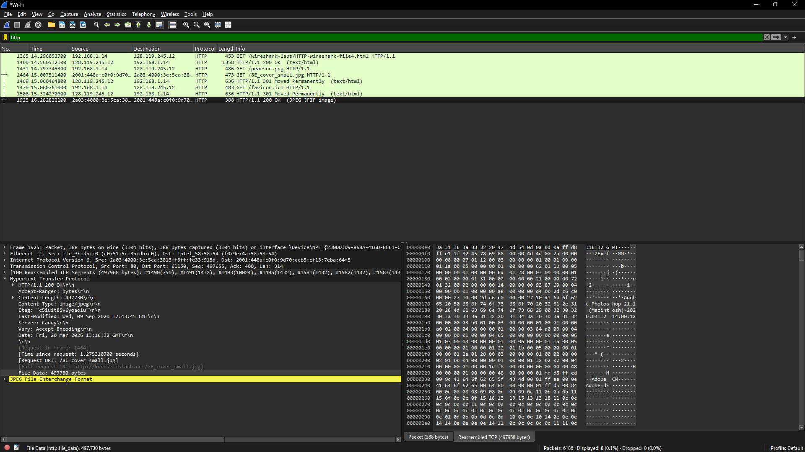
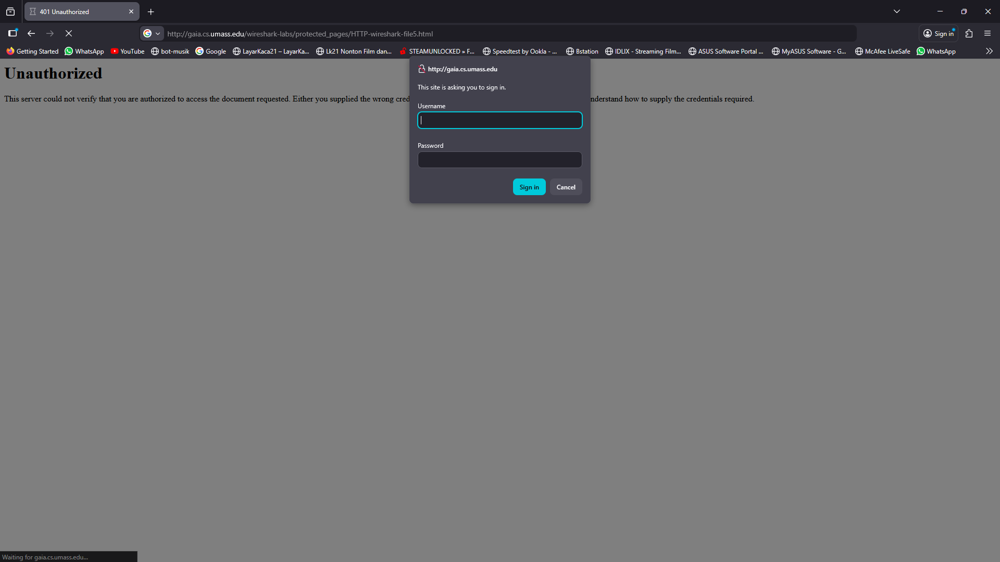
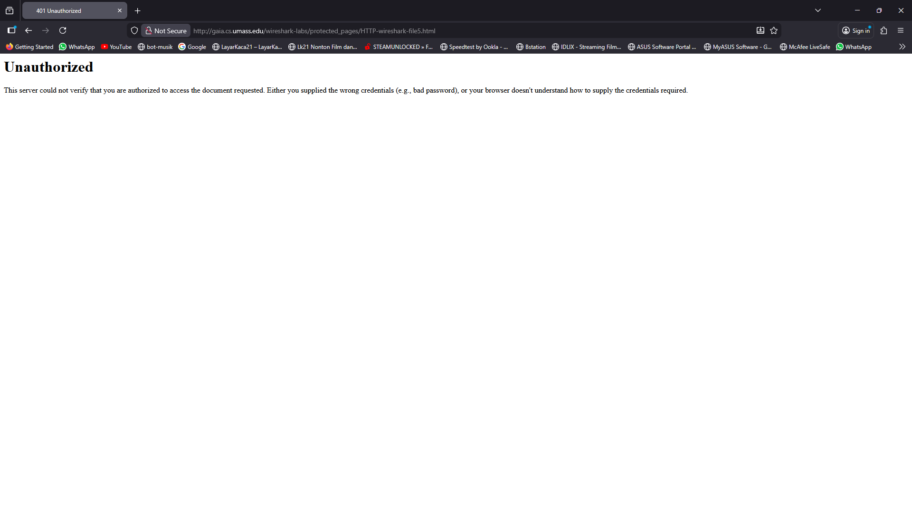
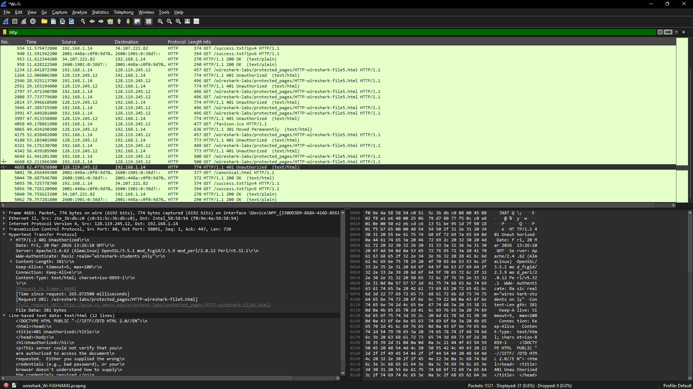
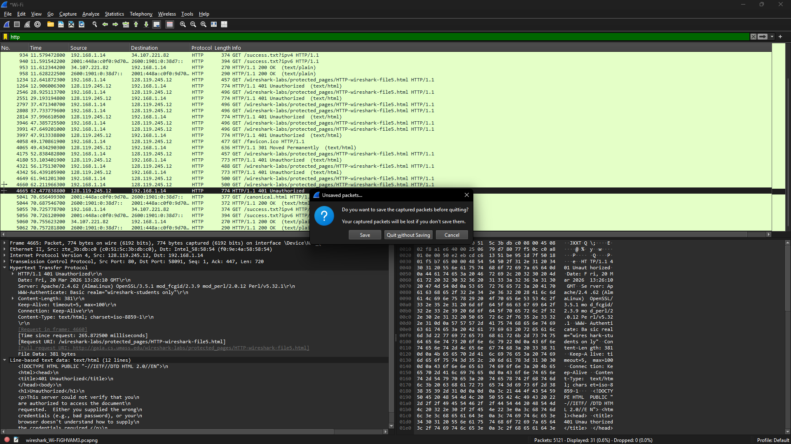

# Laporan Praktikum Minggu 3

Nama       : Gde Andika Ananta Putra  
NIM        : 103072400014  
Kelas      : IF-04-05  
Mata Kuliah: Jaringan Komputer  
__________________________________________
pada minggu kemarin kita sudah mempelajari bagaimana cara mencari atau memfilter suatu protokol pada wireshark.
lalu di laporan kali ini kita akan melanjutkan pembelajaran pada wireshark untuk basic HTTP GET/response interaction.

# modul 3
## modul (3.2) Basic HTTP GET/response interaction  
pada materi 3.2 ini kita akan membahas hal lain yaitu Basic HTTP GET/response interaction.

## percobaan pertama
1. Membuka aplikasi wireshark

2.lalu klik wifi tampilannya akan menjadi seperti ini

3.jika sudah lalu lanjutkan untuk masuk ke website http://gaia.cs.umass.edu/wireshark-labs/HTTP-wireshark-file1.html

4.Gunakan cara seperti sebelumnya lalu cari HTTP

## uji coba web not found
pada percobaan kali ini hanya menguji coba jika mencari alamat web yang asal tpi tetap menggunakan http

## percobaan web not found
1.sama seperti percobaan pertama membuka wireshark terlebih dahulu lalu pilih wifi capture pocket

2.jika sudah lalu masuk ke browser lalu search http://gaia.cs.umass.edu/wireshark-labs/HTTP-wireshark-file1.htmlregergev

3.jika sudah membuka link tersebut wireshark akan menampilkan ini

## Modul 3.3 Retrieving Long Documents
pada materi ini kita akan mempelajari Retrieving Long Documents yaitu proses mengambil data berukuran besar di dalam wireshark

## percobaan retrieving Long Documents
1.sama seperti percobaan pertama membuka wireshark terlebih dahulu lalu pilih wifi capture pocket

2.jika sudah lalu buka browser masuk ke link: http://gaia.cs.umass.edu/wireshark-labs/HTTP-wireshark-file3.html

3.setelah itu kembali ke wireshark lalu cek line yang berisi 200 ok

## Modul 3.4 HTML Documents dengan Embedded Objects 
pada materi ini kita akan mempelajari HTML Documents dengan Embedded Objects yang artinya HTML yang memiliki objek tambahan di dalamnya seperti gambar, CSS, dan JavaScript, yang saat dibuka akan menyebabkan browser mengirim beberapa request yang dapat terlihat di Wireshark.

## percobaan HTML Documents dengan Embedded Objects 
1.sama seperti percobaan pertama membuka wireshark terlebih dahulu lalu pilih wifi capture pocket

2.jika sudah maka lanjutkan ke browser kalian dan copas link ini di browser kalian  http://gaia.cs.umass.edu/wireshark-labs/HTTP-wireshark-file4.html

3.setelah itu kembali ke wireshark lalu cek line yang berisi jpeg

##  Modul 3.4 HTTP Authentication 
pada materi ini kita akan mempelajari HTTP Authentication atau bisa kita sebut login untuk mendapatkan akses ke suatu website jadi proses ini bisa kita lakukan di http dan akan terekam oleh wireshark

## percobaan HTTP Authentication
1.sama seperti percobaan pertama membuka wireshark terlebih dahulu lalu pilih wifi capture pocket

2.jika sudah maka lanjutkan ke browser kalian dan copas link ini di browser kalian http://gaia.cs.umass.edu/wireshark-labs/protected_pages/HTTP-wireshark-file5.html
ini tampilan untuk sign in nya

lalu ini tampilan jika sudah gagal melakukan sign in

3.jika sudah lalu masuk kembali ke wireshark dan wireshark akan menampilkan Unauthorized jika gagal log in

## End Of The Tutor
jadi jika kalian sudah selesai maka pencet tombol silang di kanan atas

lalu klik tombol quit without saving