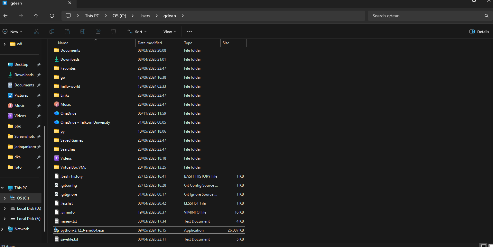

# Laporan Praktikum Minggu 1

Nama       : Gde Andika Ananta Putra  
NIM        : 103072400014  
Kelas      : IF-04-05  
Mata Kuliah: Jaringan Komputer  
__________________________________________

# MODUL 4 (DNS)
Domain Name System (DNS) memiliki peran penting dalam infrastruktur internet, yaitu untuk mentranslasikan nama domain menjadi alamat IP. Pada modul ini, kita mempelajari bagaimana DNS bekerja dari sisi klien, yaitu dengan cara mengirim permintaan ke server DNS dan menerima respon balik.

## MODUL 4.2 Nslookup
Nslookup adalah tool yang digunakan untuk mencari informasi DNS, seperti mengetahui alamat IP dari sebuah domain maupun sebaliknya. Tool ini sering digunakan untuk troubleshooting jaringan.

### Langkah - Langkah Percobaan

1.Buka Command Prompt, lalu masukan command berikut: nslookup www.mit.edu

Fungsi: untuk mengetahui alamat IP dari domain

2.lalu masukan command ini juga: nslookup -type=NS mit.edu

Fungsi: untuk mengetahui DNS server (authoritative server)

3.lalu masukan lagi command nslookup "www.aiit.or.kr bitsy.mit.edu" ini di cmd

Fungsi: melakukan query ke DNS tertentu

## Pertanyaan

1.Mencari IP server web di Asia
- Perintah : nslookup www.u-tokyo.ac.jp
- Domain : www.u-tokyo.ac.jp
- Alamat IP : 210.152.243.234

command "nslookup www.u-tokyo.ac.jp" ini mengirim request ke DNS server untuk menerjemahkan domain menjadi IP address

2.Mencari DNS otoritatif universitas di Eropa
- Perintah : nslookup -type=MX gmail.com dns0.cam.ac.uk

command "nslookup -type=NS cam.ac.uk" ini untuk Menampilkan server DNS yang bertanggung jawab terhadap domain tersebut.

3.Mencari mail server

command "nslookup -type=MX gmail.com dns0.cam.ac.uk" ini untuk Menampilkan mail server (MX record) dari domain tertentu melalui DNS tertentu.

## Modul 4.3 Ipconfig
Ipconfig adalah perintah pada Windows untuk melihat dan mengelola konfigurasi jaringan seperti IP address, DNS, dan gateway.

### Langkah - Langkah Percobaan
1.Sama seperti cara di awal buka cmd lalu masukan command:ipconfig /all

fungsi:Menampilkan IP address, DNS server, dan informasi jaringan lainnya.

2.lalu masukan command "ipconfig /all > savefile.txt" ini jika ingin save semua hasil yang tadi kita sudah coba

3.lalu hasil yang save tadi akan masuk ke path "C:\Users\gdean" untuk di leptop saya

4.lalu masukan command "ipconfig /displaydns" untuk Menampilkan cache DNS

5.lalu jika ingin menghapus chache bisa menggunakan command "ipconfig /flushdns"
