# Laporan Praktikum Minggu 1

Nama       : Gde Andika Ananta Putra  
NIM        : 103072400014  
Kelas      : IF-04-05  
Mata Kuliah: Jaringan Komputer  
__________________________________________

# MODUL 4 (DNS)
Domain Name System (DNS) memiliki peran penting dalam infrastruktur internet, yaitu untuk mentranslasikan nama domain menjadi alamat IP. Pada modul ini, kita mempelajari bagaimana DNS bekerja dari sisi klien, yaitu dengan cara mengirim permintaan ke server DNS dan menerima respon balik.

## MODUL 4.2 Nslookup
Nslookup adalah tool yang digunakan untuk mencari informasi DNS, seperti mengetahui alamat IP dari sebuah domain maupun sebaliknya. Tool ini sering digunakan untuk troubleshooting jaringan.

### Langkah - Langkah Percobaan

1.Buka Command Prompt, lalu masukan command berikut: nslookup www.mit.edu

Fungsi: untuk mengetahui alamat IP dari domain

2.lalu masukan command ini juga: nslookup -type=NS mit.edu

Fungsi: untuk mengetahui DNS server (authoritative server)

3.lalu masukan lagi command nslookup "www.aiit.or.kr bitsy.mit.edu" ini di cmd

Fungsi: melakukan query ke DNS tertentu

## Pertanyaan

1.Mencari IP server web di Asia
- Perintah : nslookup www.u-tokyo.ac.jp
- Domain : www.u-tokyo.ac.jp
- Alamat IP : 210.152.243.234

command "nslookup www.u-tokyo.ac.jp" ini mengirim request ke DNS server untuk menerjemahkan domain menjadi IP address

2.Mencari DNS otoritatif universitas di Eropa
- Perintah : nslookup -type=MX gmail.com dns0.cam.ac.uk

command "nslookup -type=NS cam.ac.uk" ini untuk Menampilkan server DNS yang bertanggung jawab terhadap domain tersebut.

3.Mencari mail server

command "nslookup -type=MX gmail.com dns0.cam.ac.uk" ini untuk Menampilkan mail server (MX record) dari domain tertentu melalui DNS tertentu.

## Modul 4.3 Ipconfig
Ipconfig adalah perintah pada Windows untuk melihat dan mengelola konfigurasi jaringan seperti IP address, DNS, dan gateway.

### Langkah - Langkah Percobaan
1.Sama seperti cara di awal buka cmd lalu masukan command:ipconfig /all

fungsi:Menampilkan IP address, DNS server, dan informasi jaringan lainnya.

2.lalu masukan command "ipconfig /all > savefile.txt" ini jika ingin save semua hasil yang tadi kita sudah coba

3.lalu hasil yang save tadi akan masuk ke path "C:\Users\gdean" untuk di leptop saya

4.lalu masukan command "ipconfig /displaydns" untuk Menampilkan cache DNS

5.lalu jika ingin menghapus chache bisa menggunakan command "ipconfig /flushdns"

## Modul 4.4 Tracing DNS dengan Wireshark
Tracing DNS digunakan untuk melihat proses request dan response DNS menggunakan Wireshark.

## A. Analisis DNS Request dan Response pada Akses Website (www.ietf.org)

### Langkah - Langkah Percobaan
1.buka cmd dan masukan command "ipconfig" jika ingin melihat IPv4 address 
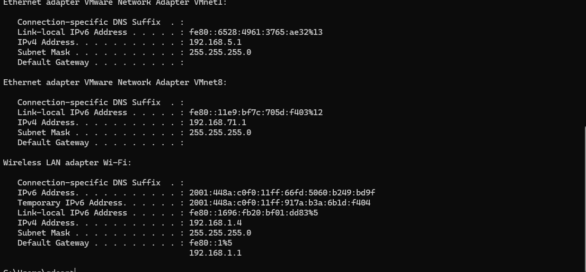

2.setelah mendapatkan IPv4 address masing-masing lalu buka wireshark dan click wifi kemudian masukkan di filter ip.addr == 192.168.1.4 (sesuai IPv4 masing-masing)
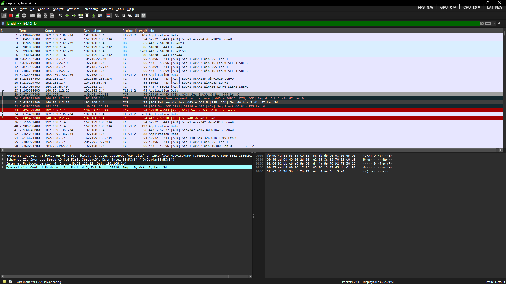

3.lalu masuk ke web "https://www.ietf.org/" 
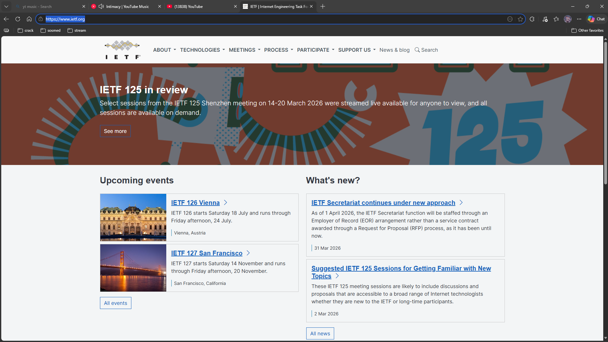

4.kemudian masuk kembali ke wireshark dan masukkan di filter dengan " ip.addr == 192.168.1.4 && dns.qry.name contains "ietf" "
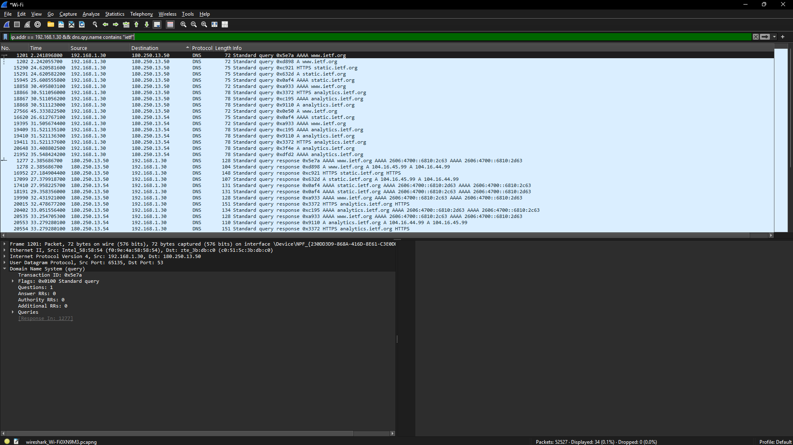

### Pertanyaan

1.Apakah DNS menggunakan UDP atau TCP?

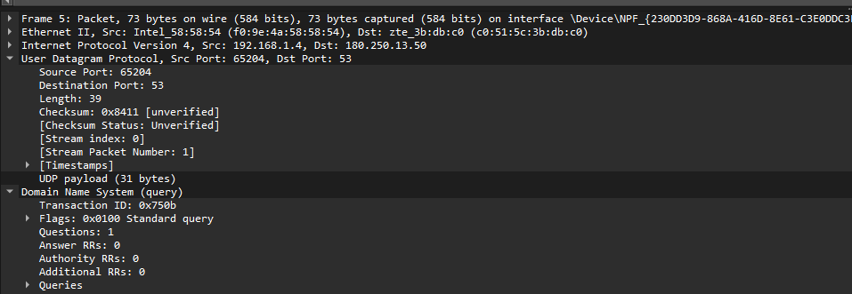

Jawab: Dns menggunakan UDP

2.Port tujuan pada DNS request & port sumber pada DNS response 

Jawab:

-DNS REQUEST -> Source Port (client): 63768 & Destination Port (server): 53

DNS RESPONSE -> Source Port (server): 53 & Destination Port (client): 63768 

## Analisis DNS Menggunakan Perintah nslookup (www.mit.edu)

### Langkah - Langkah Percobaan

1.buka cmd lalu masukan command nslookup www.mit.edu
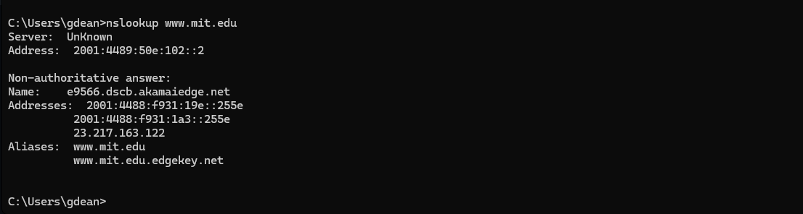

2.kemudian masuk kembali ke wireshark dan masukkan di filter dengan DNS, lalu ambil data dari Standard query (request) dan Standard query response dari www.mit.edu
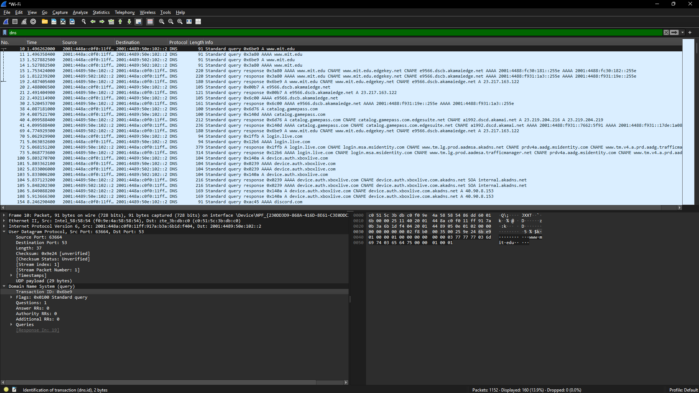

### Pertanyaan

1.Port tujuan request dan port sumber dari response Jawab:

- DNS REQ -> port 53
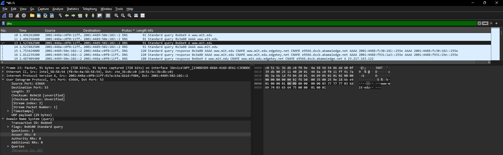
- DNS RESPONSE ->
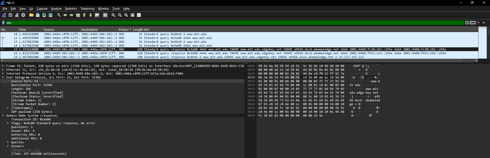

2.Ke  alamat  IP  manakah  pesan  permintaan  DNS  dikirimkan?
jawab:
Request DNS dikirim ke alamat IP 2001:448a:c0f0:11ff:66fd:5060:b249:bd9f, alamat tersebut merupakan alamat lokal (IPv6) yang digunakan sebagai DNS server dalam jaringan
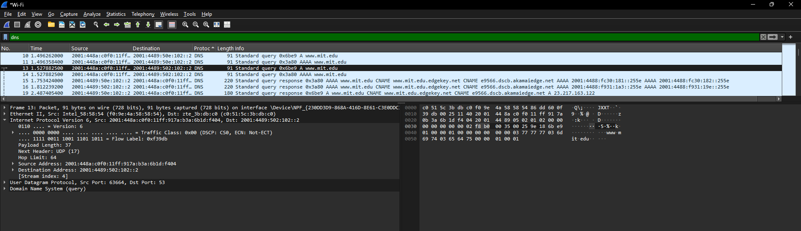

3.Periksa pesan permintaan DNS. Apa ”jenis” atau ”type” dari pesan tersebut? Apakah pesan tersebut mengandung ”jawaban” atau ”answers”?
Jawab:
Tipe DNS request adalah A (Address Record). Pesan ini tidak mengandung jawaban karena hanya berupa permintaan 

4.Periksa pesan balasan DNS. Berapa banyak ”jawaban” atau “answers” yang terdapat di dalamnya. Apa saja isi yang terkandung dalam setiap jawaban tersebut? 
jawab:
Terdapat 3 jawaban
- Jawaban pertama menunjukkan bahwa domain www.mit.edu merupakan alias (CNAME) ke www.mit.edu.edgekey.net, yang berarti domain utama diarahkan ke domain lain.
- Jawaban kedua menunjukkan alias lanjutan, yaitu www.mit.edu.edgekey.net kembali diarahkan (CNAME) ke e9566.dscb.akamaiedge.net.
- Jawaban ketiga merupakan hasil akhir berupa A record, yaitu alamat IP 23.217.163.122, yang menjadi tujuan sebenarnya dari proses resolusi domain tersebut. 
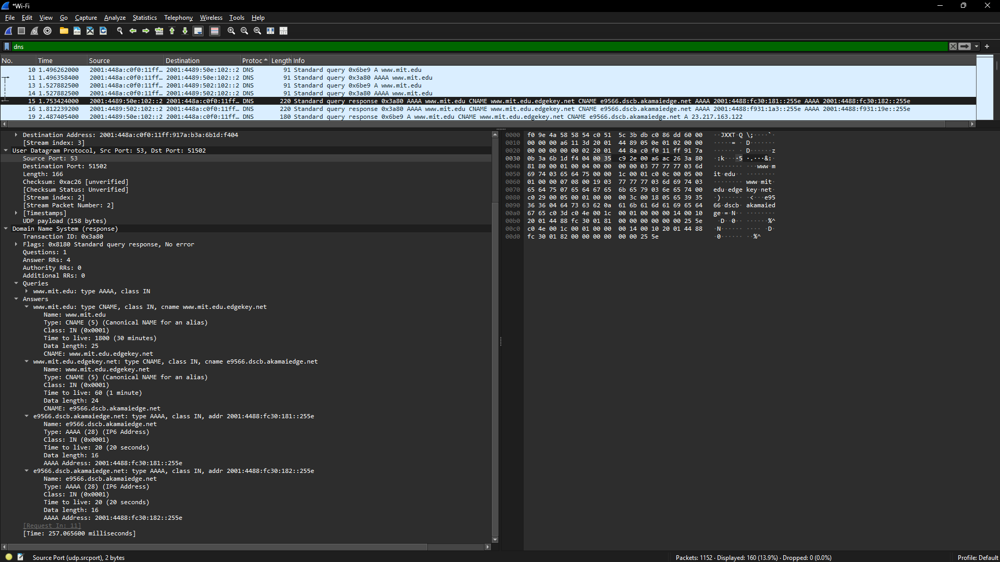

## Analisis DNS Record NS Menggunakan nslookup (mit.edu)
1.buka cmd lalu masukan command nslookup -type=NS mit.edu 

2.kemudian masuk kembali ke wireshark dan masukkan di filter dengan DNS, lalu ambil data dari Standard query (request) dari www.mit.edu
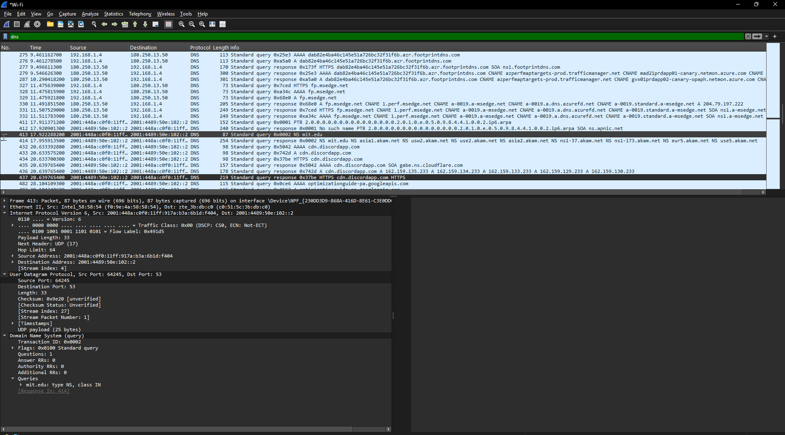

### Langkah - Langkah Percobaan

1.Ke  alamat  IP  manakah  pesan  permintaan  DNS  dikirimkan?
Jawab: Request DNS dikirim ke alamat IP 2001:4489: yang merupakan DNS default pada jaringan

2.apakah pesan tersebut mengandung ”jawaban” atau ”answers”?  
Jawab: Tipe DNS request adalah NS. Pesan ini tidak mengandung jawaban karena hanya berupa permintaan 

3.Apakah pesan balasan ini juga memberikan alamat IP untuk server MIT tersebut? 
jawab: Pada DNS response, diperoleh beberapa nama server MIT. Pesan balasan ini umumnya hanya menampilkan nama server (NS record), dan tidak alamat IP secara langsung pada bagian answers 
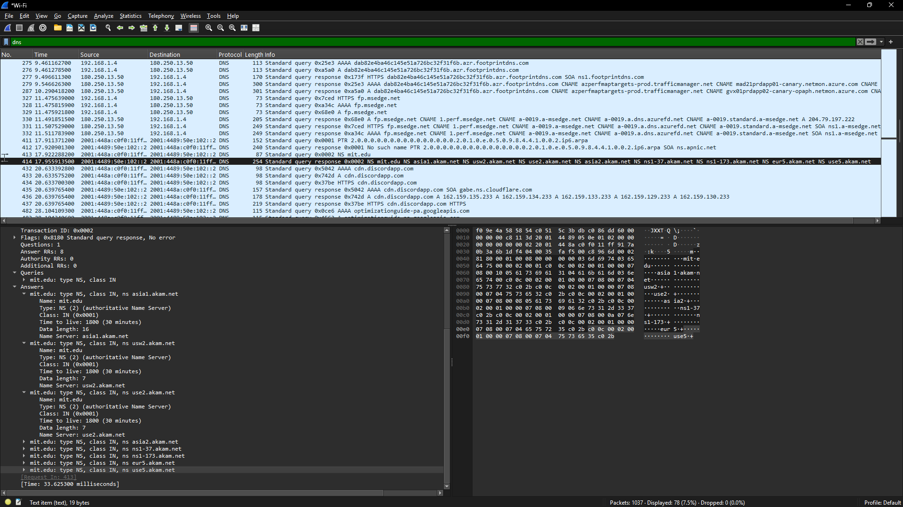

