Nama       : Gde Andika Ananta Putra  
NIM        : 103072400014  
Kelas      : IF-04-05  
Mata Kuliah: Jaringan Komputer  
__________________________________________
# 6.2 Menangkap Tansfer TCP dalam Jumlah Besar dari Komputer Pribadi ke remote server
TCP (Transmission Control Protocol) adalah protokol lapisan transport yang bersifat connection-oriented, sehingga koneksi harus dibangun terlebih dahulu sebelum data dikirim. TCP menjamin pengiriman data yang andal melalui mekanisme seperti sequence number, acknowledgment, flow control, dan congestion control.

## langkah-langkah percobaan

1.buka browser http://gaia.cs.umass.edu/wireshark-labs/TCP-wireshark-file1.html dan pilih file alice.txt

2.buka wireshark dan pilih wifi lalu start record

3.Kembali ke browser klik Upload alice.txt hingga muncul tampilan “Congratulations”

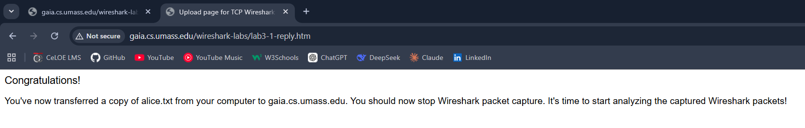

4.stop record kemudian filter tcp

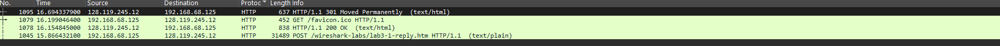

- Paket yang muncul berupa segmen TCP dan paket HTTP, sehingga dapat disimpulkan bahwa proses upload file menggunakan protokol HTTP yang berjalan di atas TCP.
- Paket SYN digunakan untuk membangun koneksi TCP antara client dan server melalui proses three-way handshake, bukan untuk mengirim data file. Setelah koneksi berhasil dibuat, file akan dikirim dalam beberapa segmen TCP yang lebih kecil agar proses transfer data lebih efisien dan mudah dikontrol.

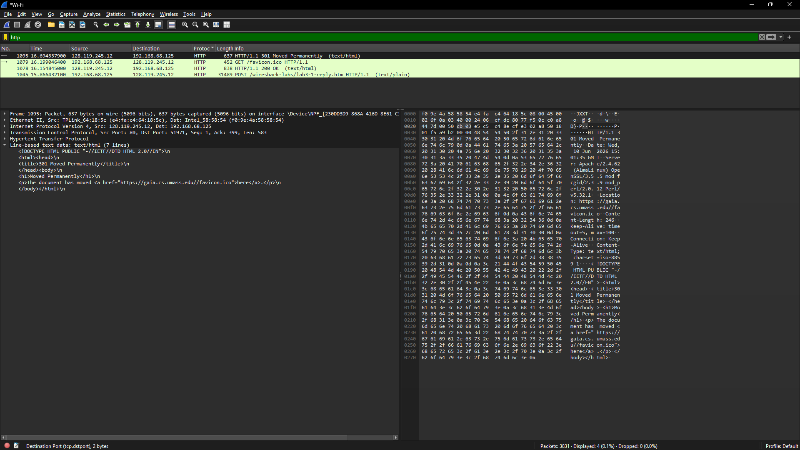

- Setelah proses upload selesai, server mengirimkan respons HTTP/1.1 200 OK, yang menunjukkan bahwa file telah berhasil diterima dan diproses. Selanjutnya, halaman web menampilkan pesan “Congratulations” sebagai konfirmasi bahwa proses upload file telah berhasil dilakukan.

## jawab pertanyaan
1.IP dan port TCP komputer klien mencari data di filter "HTTP" dan pilih paket POST
- IP Server: 128.119.245.12
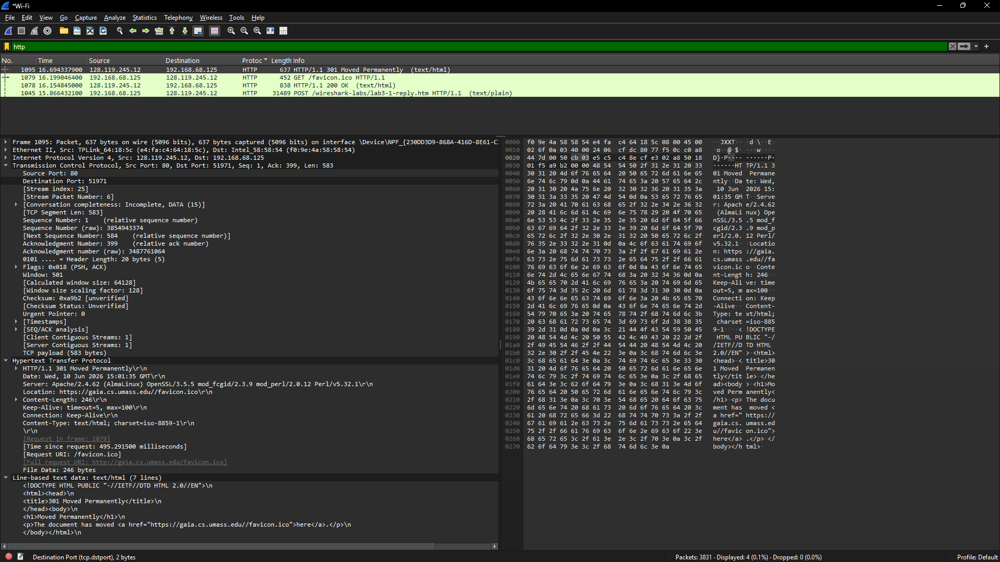

- Port server : 51971

2.IP dan port TCP server mencari data di filter "HTTP" dan pilih paket HTTP/1.1 200 OK
- IP Server: 192.168.68.125

- port 80

# Perobaan Dasar TCP

## Langkah-Langkah Percobaan

1.Download dan extrak file http://gaia.cs.umass.edu/wireshark-labs/wireshark-traces.zip

2.Buka file yang sudah di extrak tadi di dalam wireshark
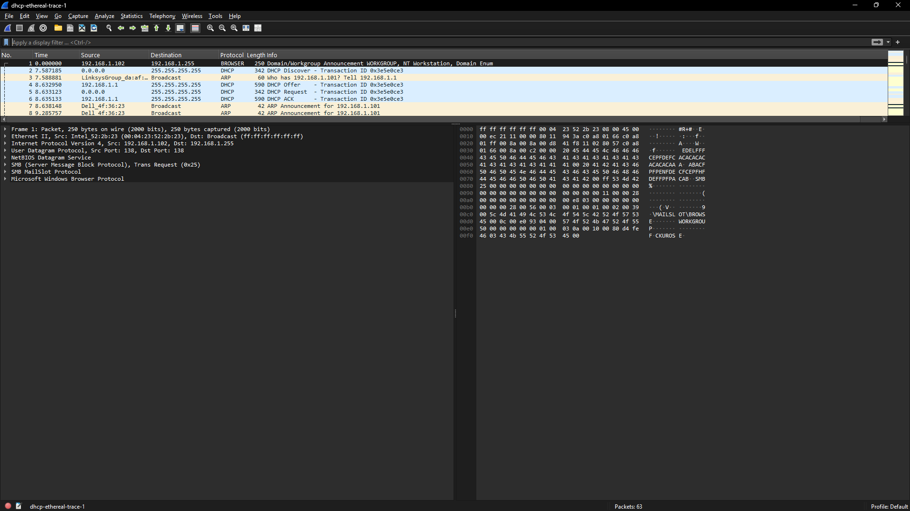

## pertanyaan

1.Nomor urut SYN, mencari data di filter tcp.flags.syn == 1 && tcp.flags.ack == 0
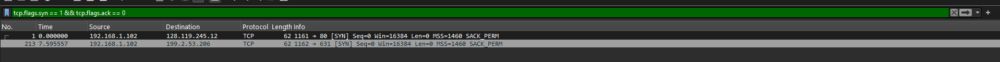
- Nomor urut pada segmen TCP SYN adalah 0. Segmen ini teridentifikasi sebagai SYN karena memiliki flag SYN pada bagian TCP Flags.
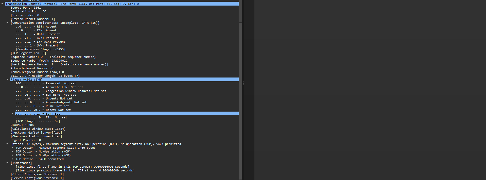

2.SYN-ACK, mencari data di filter tcp.flags.syn == 1 && tcp.flags.ack == 1 
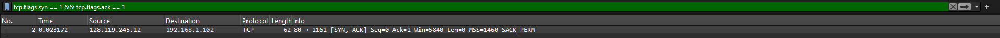

- Nomor urut (sequence number) pada segmen SYN-ACK adalah 0, sedangkan nilai acknowledgment adalah 1. Nilai acknowledgment diperoleh dari sequence number pada segmen SYN sebelumnya yang ditambah 1. Segmen ini dapat diidentifikasi sebagai SYN-ACK karena memiliki flag SYN dan ACK pada bagian TCP Flags  
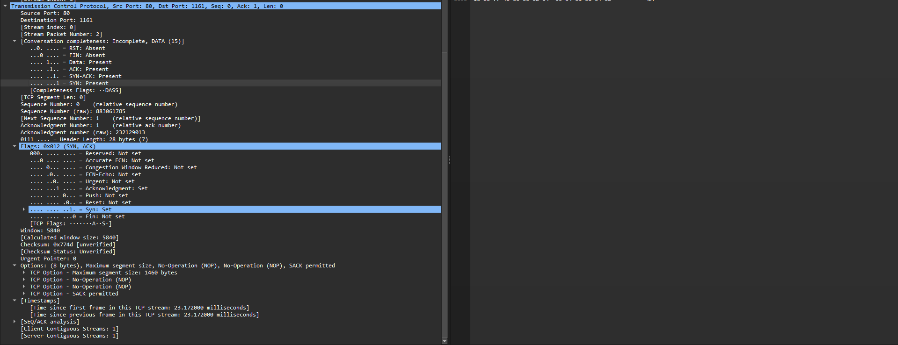

3.Sequence number POST, mencari data di filter tcp.port == 1161 && tcp contains "POST"
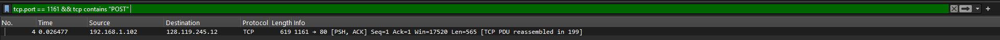
- Nomor urut segmen TCP yang berisi perintah HTTP POST adalah 1 
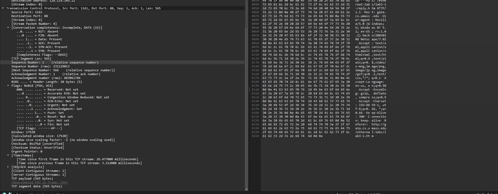

4.6 segmen pertama + RTT 
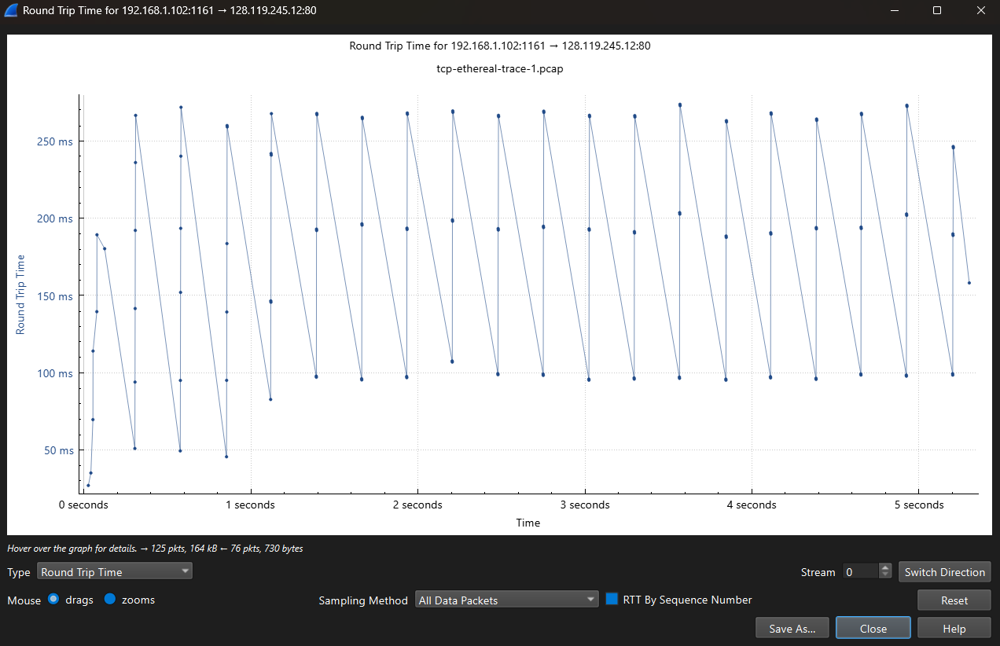
- Nilai RTT diperoleh dari selisih waktu antara pengiriman segmen TCP dan penerimaan acknowledgment. Berdasarkan grafik Round Trip Time, nilai RTT berkisar antara sekitar 100 ms hingga 300 ms. Nilai RTT ini bervariasi karena dipengaruhi oleh kondisi jaringan selama proses transfer

5.Panjang 6 segmen 
- Panjang 6 segmen adalah 8760 byte

6.Buffer receiver.
- Nilai minimum ruang buffer yang tersedia pada penerima adalah 5840 byte, yang terlihat dari nilai window size pada segmen TCP
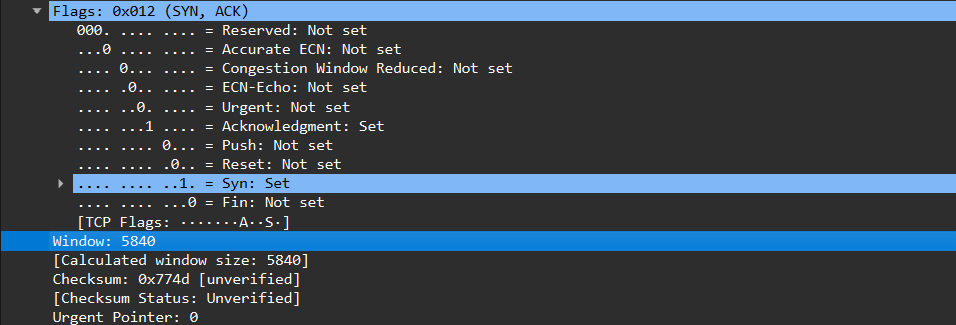

7.Retransmission 

Tidak ditemukan retransmission / ditemukan retransmission. Hal ini dapat dilihat dari tidak adanya / adanya label “TCP Retransmission” pada Wireshark.

8.ACK behavior
- Jumlah data yang di-ACK tidak tetap dan bisa banyak. Penerima dapat mengakui beberapa segmen sekaligus, tidak selalu satu per satu
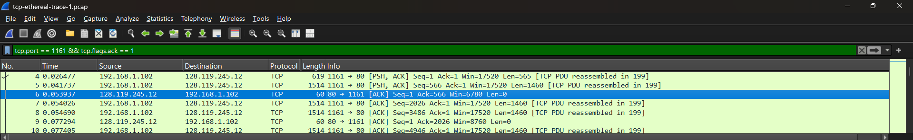

9.Thoroughtput
- Throughput adalah jumlah data yang ditransfer per satuan waktu. Berdasarkan grafik throughput, kecepatan transfer meningkat secara bertahap hingga mencapai sekitar 200 kbps hingga 270 kbps. Nilai ini menunjukkan performa koneksi TCP selama proses pengiriman data 

# Congestion Control pada TCP
## Berikut Langkah-Langkahnya dan Menjawab Pertanyaan:
1.Identifikasi Slow Start & Congestion Avoidance (file tcp-ethereal-trace-1)
- Buka file tcp-ethereal-trace-1 dengan wireshark
- Filter "TCP"
- Pada awal koneksi (±0–1 detik), TCP berada pada fase slow start dengan pertumbuhan eksponensial hingga mencapai threshold. Setelah itu, TCP memasuki fase congestion avoidance dengan pertumbuhan linear. Grafik menunjukkan koneksi yang cukup stabil tanpa indikasi packet loss atau timeout yang signifikan, meskipun terdapat sedikit penyimpangan dari model ideal akibat delay dan variasi ACK.

2.Identifikasi Slow Start & Congestion Avoidance (alice.txt)
- Uploud file alice.txt ke http://gaia.cs.umass.edu/wireshark-labs/TCP-wireshark-file1.html
- Kembali ke wireshark dan filter "TCP"
- Klik Statistics -> TCP Stream Graph -> Time-Sequence Graph (Stevens) 
- Pada awal koneksi, TCP mengalami fase slow start dengan pertumbuhan eksponensial yang cepat, lalu beralih ke congestion avoidance lebih awal dibanding grafik sebelumnya. Hal ini menunjukkan respons Wi-Fi yang lebih cepat, meskipun lebih rentan terhadap variasi delay. Secara keseluruhan, koneksi tetap stabil, namun sedikit menyimpang dari perilaku TCP ideal karena karakteristik jaringan nirkabel.
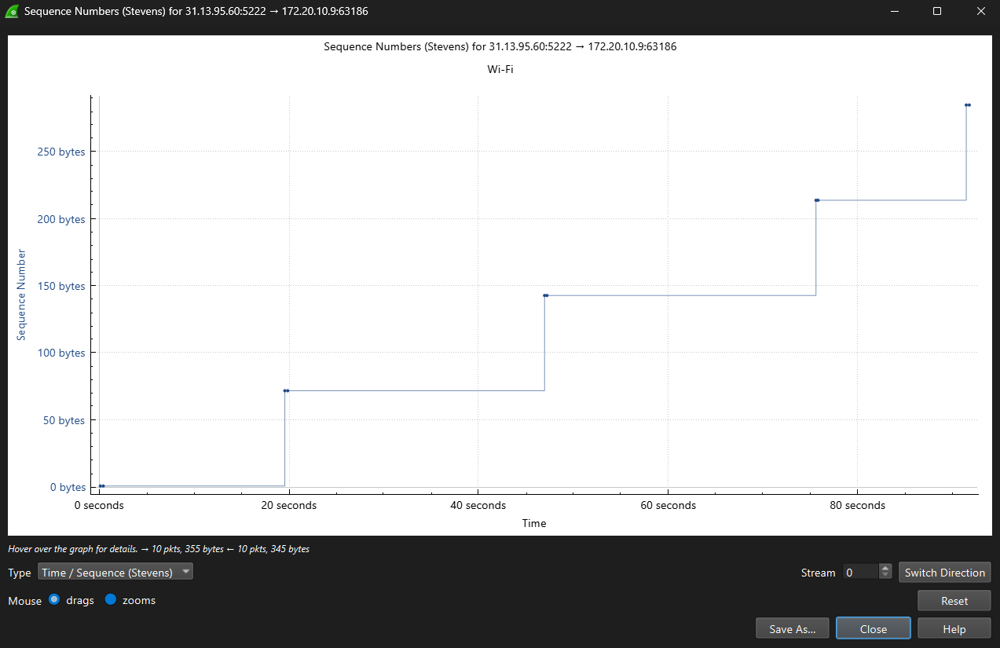