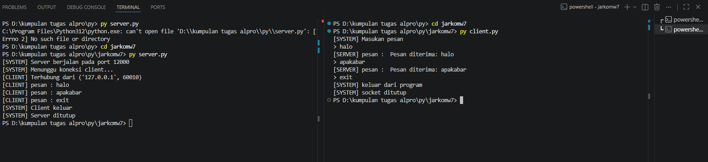

Nama       : Gde Andika Ananta Putra  
NIM        : 103072400014  
Kelas      : IF-04-05  
Mata Kuliah: Jaringan Komputer  
__________________________________________

# Modul 7 - SOCKET PROGRAMMING

## penjelasan socket
Socket programming adalah metode komunikasi antar komputer dalam jaringan menggunakan socket sebagai penghubung. Terdapat dua peran utama, yaitu client yang mengirim data dan server yang menerima serta merespons data. Komunikasi dapat menggunakan protokol TCP yang andal atau UDP yang lebih cepat namun tanpa jaminan pengiriman. Dengan demikian, socket programming memungkinkan pertukaran data secara langsung antar perangkat dalam jaringan.

# implementasi TCP

## TCP Client
```python
from socket import * # import all libary

serverName = "localhost" # alamat server
serverPort = 12000 # membuat port untuk komunikasi

clientSocket = socket(AF_INET, SOCK_STREAM) # membuat socket ipv4 dan TCP
clientSocket.connect( # menghubungkan socket ke server
    (serverName, serverPort)
)

print("[SYSTEM] Masukan pesan") # pesan yang akan dikirim ke server

running = True # variabel untuk menjalankan program, jika false program akan berhenti
while running: # loop agar program terus berjalan
    message = input("> ") # input pesan yang akan dikirim ke server
    
    # mengirim pesan ke server, encode untuk mengubah string menjadi byte
    clientSocket.send(message.encode()) 
    if message == "exit": # pesan "exit" untuk keluar dari program
        print("[SYSTEM] keluar dari program")
        running = False # ubah variabel running menjadi false untuk keluar dari loop
        break

    modifiedMessage = clientSocket.recv(2048) # menerima pesan dari server, 2048 adalah ukuran buffer
    print("[SERVER] pesan : ", modifiedMessage.decode()) # decode untuk mengubah byte menjadi string

clientSocket.close() # menutup socket
print("[SYSTEM] socket ditutup")
```
## TCP server
```python
from socket import *                         # import semua library socket

serverPort = 12000                           # port yang digunakan server

serverSocket = socket(AF_INET, SOCK_STREAM)  # membuat socket IPv4 dan TCP
serverSocket.bind(("", serverPort))          # bind ke semua interface pada port 12000
serverSocket.listen(1)                       # mulai mendengarkan koneksi (maks 1 antrean)

print(f"[SYSTEM] Server berjalan pada port {serverPort}")  # informasi server aktif
print("[SYSTEM] Menunggu koneksi client...")               # menunggu client terhubung

connectionSocket, addr = serverSocket.accept()  # menerima koneksi dari client

print(f"[CLIENT] Terhubung dari {addr}")        # menampilkan alamat client

running = True                                  # variabel kontrol loop

while running:                                  # loop utama server

    message = connectionSocket.recv(2048).decode()  # menerima data lalu decode ke string

    if not message:                             # jika koneksi ditutup client
        break                                  # keluar dari loop

    print("[CLIENT] pesan :", message)          # menampilkan pesan dari client

    if message.lower() == "exit":               # jika client mengirim exit
        print("[SYSTEM] Client keluar")         # informasi client keluar
        running = False                         # hentikan loop
        break                                  # keluar dari loop

    reply = f"Pesan diterima: {message}"        # membuat pesan balasan

    connectionSocket.send(reply.encode())       # kirim balasan ke client

connectionSocket.close()                        # tutup koneksi client
serverSocket.close()                            # tutup socket server

print("[SYSTEM] Server ditutup")                # informasi server berhenti
```

## Alur TCP
1. Server dijalankan terlebih dahulu
2. Client melakukan koneksi ke server
3. Client mengirim data
4. Server memproses data
5. Server mengirim hasil ke client
6. Client menampilkan hasil
7. Jika kita ketik exit kita akan keluar dan server berhenti

### Output


# Implementasi UDP

## UDP Client
```python
from socket import *                             # import semua library socket

serverName = 'localhost'                         # alamat server (localhost = komputer sendiri)
serverPort = 12000                               # port tujuan server

clientSocket = socket(AF_INET, SOCK_DGRAM)       # membuat socket IPv4 dan UDP

print("[SYSTEM] Masukkan pesan (ketik 'exit' untuk keluar)\n")  # instruksi untuk pengguna

while True:                                      # loop agar client terus berjalan

    message = input("> ")                        # menerima input dari pengguna

    if not message:                              # jika input kosong
        continue                                 # kembali meminta input

    clientSocket.sendto(                         # mengirim pesan ke server
        message.encode(),                        # encode string menjadi byte
        (serverName, serverPort)                 # alamat dan port tujuan
    )

    if message.lower() == 'exit':                # jika pengguna mengetik exit
        print("[SYSTEM] Keluar dari program.")   # tampilkan pesan keluar
        break                                    # keluar dari loop

    balasan, _ = clientSocket.recvfrom(2048)     # menerima balasan dari server
                                                 # 2048 = ukuran buffer maksimum

    print(f"[SERVER] pesan: {balasan.decode()}\n")  # decode byte menjadi string lalu tampilkan

clientSocket.close()                             # menutup socket client

print("[SYSTEM] Socket ditutup.")                # konfirmasi socket telah ditutup
```
## UDP Server
```python
from socket import *                            # import semua library socket

serverPort = 12000                              # port yang digunakan server

serverSocket = socket(AF_INET, SOCK_DGRAM)      # membuat socket IPv4 dan UDP
serverSocket.bind(("", serverPort))             # bind ke port 12000

print(f"[SYSTEM] Server UDP berjalan di port {serverPort}")
print("[SYSTEM] Menunggu pesan dari client...\n")

running = True                                  # variabel kontrol loop

while running:                                  # loop utama server

    message, clientAddress = serverSocket.recvfrom(2048)  # menerima data dan alamat client
    message = message.decode()                  # ubah byte menjadi string

    print(f"[CLIENT {clientAddress}] pesan: {message}")

    if message.lower() == "exit":               # jika client mengirim exit
        print("[SYSTEM] Client keluar.")
        running = False                         # hentikan server
        break

    balasan = f"Pesan diterima: {message}"      # membuat pesan balasan

    serverSocket.sendto(                        # kirim balasan ke client
        balasan.encode(),
        clientAddress
    )

serverSocket.close()                            # menutup socket server

print("[SYSTEM] Server ditutup.")
```

## Alur UDP
1. Server dijalankan
2. Client langsung mengirim data tanpa koneksi
3. Server menerima data
4. Server memproses
5. Server mengirim balasan
6. Client menerima hasil
7. Jika kita ketik exit kita akan keluar dan server berhenti

### Output
