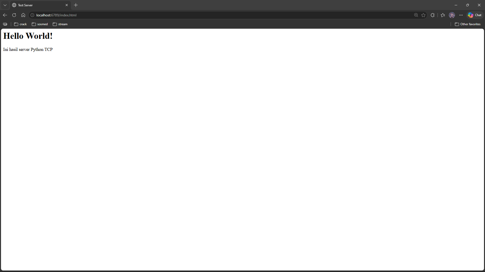
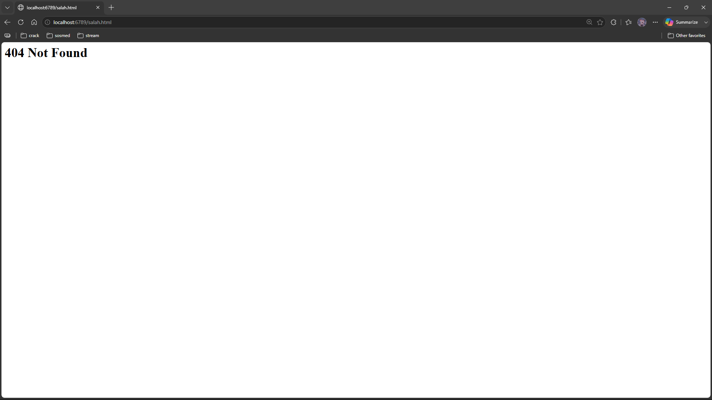
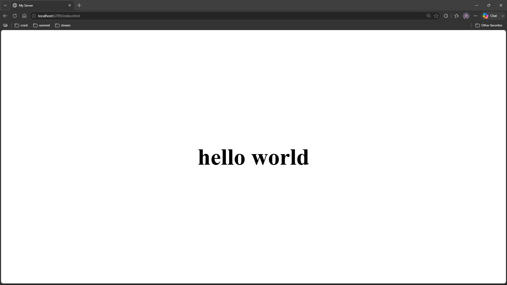

Nama       : Gde Andika Ananta Putra  
NIM        : 103072400014  
Kelas      : IF-04-05  
Mata Kuliah: Jaringan Komputer
__________________________________________

# Web Server
Web server adalah bagian penting dalam komunikasi di internet. Web server bertugas menerima permintaan dari pengguna melalui browser, lalu mengirimkan halaman web atau data yang diminta. Komunikasi ini biasanya menggunakan protokol HTTP yang berjalan di atas TCP.

## Langkah-Langkah
  1. mebuat folder week9
  2. Membuat file serverweb.py di VScode
```python
from socket import *
import sys

# membuat socket server (TCP)
serverSocket = socket(AF_INET, SOCK_STREAM)

# Prepare a server socket
serverPort = 6789
serverSocket.bind(('', serverPort))
serverSocket.listen(1)

while True:
    # Establish the connection
    print('Ready to serve...')
    connectionSocket, addr = serverSocket.accept()

    try:
        # menerima request dari client
        message = connectionSocket.recv(1024).decode()
        print(message)

        # mengambil nama file
        filename = message.split()[1]

        # membuka file
        f = open(filename[1:])
        outputdata = f.read()

        # Send HTTP header
        connectionSocket.send("HTTP/1.1 200 OK\r\n".encode())
        connectionSocket.send("Content-Type: text/html\r\n".encode())
        connectionSocket.send("\r\n".encode())

        # kirim isi file
        for i in range(len(outputdata)):
            connectionSocket.send(outputdata[i].encode())

        connectionSocket.send("\r\n".encode())
        connectionSocket.close()

    except IOError:
        # kirim 404 jika file tidak ada
        connectionSocket.send("HTTP/1.1 404 Not Found\r\n".encode())
        connectionSocket.send("Content-Type: text/html\r\n".encode())
        connectionSocket.send("\r\n".encode())
        connectionSocket.send("<html><body><h1>404 Not Found</h1></body></html>".encode())

        # tutup koneksi
        connectionSocket.close()

serverSocket.close()
sys.exit()
```
4. Setelah itu membuat file index.html
5. lalu diisi
```html
<html>
<head>
    <title>Test Server</title>
</head>
<body>
    <h1>Hello World!</h1>
    <p>Ini hasil dari code Python TCP</p>
</body>
</html>>
```
### Hasilnya
1. Kita buka terminal lalu ketik ini "py serverweb.py" lalu di enter
2. Setelah itu Buka browser ketikan URL "http://localhost:6789/HelloWorld.html"
3. Maka akan muncul tampilan seperti ini:



4. Lalu buka tab lainnya dan ketikkan "http://localhost:6789/salah.html"
5. Maka akan muncul tampilan seperti ini:


- Server akan menampilkan pesan "404 Not Found" jika file yang diminta tidak tersedia. Hal ini menunjukkan bahwa server dapat menangani permintaan yang berhasil maupun yang gagal dengan baik.

- Program dimulai dengan membuat socket TCP menggunakan library socket. Setelah itu, server dijalankan pada port tertentu dan menunggu koneksi dari klien. Saat klien terhubung, server menerima request HTTP dan membaca nama file yang diminta. Jika file ditemukan, server mengirimkan respons 200 OK beserta isi file HTML. Jika file tidak ditemukan, server mengirimkan respons 404 Not Found. Program ini hanya dapat melayani satu klien pada satu waktu karena menggunakan metode single-threaded.

## Latihan Web Tambahan
Disini saya menggunakan server sebelumnya jdi saya hanya mengubah isi di dalam file index.html
1. buka file index.html
2. ubah isi index.html

```html
<!DOCTYPE html>
<html>
<head>
    <title>My Server</title>
    <style>
        body {
            display: flex;
            justify-content: center;  /* tengah kiri-kanan */
            align-items: center;      /* tengah atas-bawah */
            height: 100vh;
            margin: 0;
        }

        h1 {
            font-size: 80px;  /* bikin gede */
        }
    </style>
</head>

<body>
    <h1>hello world</h1>
</body>
</html>
```
3. setelah itu sama seperti proses sebelumnya yaitu menjalankan file server dulu lalu masukkan url yang sama seperti sebelumnya untuk memunculkan tampilan pada file index.html

